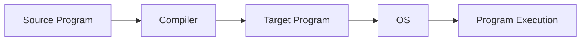
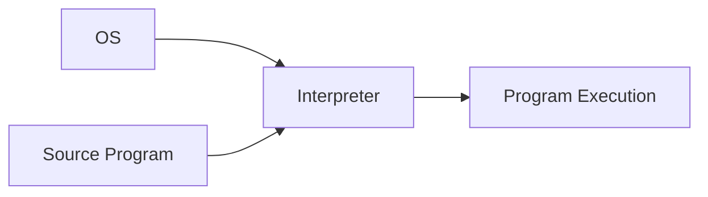
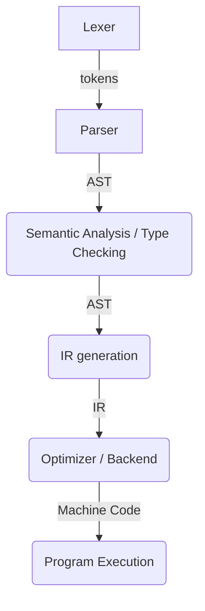

In this blog post, I'm going to provide a high-level overview of compilers and interpreters. When we talk about implementing a programming language, we can write a compiler or an interpreter to actually evaluate the source code of the programming language we are implementing. My hope with this post is to clarify what we mean by "programming language implementation," and differentiate between compilers and interpreters. 

## Compiler: A Brief Description

Both compilers and interpreters implement programming languages, but they differ in their implementation strategy. A compiler's primary task is *translation* of a source program (typically written in a high-level language) into a target program (typically expressed in a low-level language). Later, the OS of the target machine helps to load and execute the target program [(Clarkson, ch. 9.0)](https://cs3110.github.io/textbook/chapters/interp/intro.html).



## Interpreter: A Brief Description

An interpreter's primary task is *execution*. It takes as input a source program and directly executes that program without producing machine code. In this case, the OS actually loads and executes the interpreter, and the interpreter is responsible for executing the program. *Typically*, an interpreter is easier to implement than a compiler [(Clarkson, ch. 9.0)](https://cs3110.github.io/textbook/chapters/interp/intro.html). 



## Compiler Phases

A compiler goes through several phases as it translates a program. At a high-level, a compiler must process the syntax and semantics of the source program, perform type checking, and then transform the source code into machine code so that it can be executed by the target platform. By *syntax*, we mean the rules that define what constitutes a textually well-formed program in the source language, to include operators, keywords, whitespace, formatting, and the like. By *semantics*, we mean the rules that define the behavior of the program. This includes both static and dynamic semantics, where dynamic semantics define the run-time behavior of the program, and static semantics define the compile-time checking that is done (including type checking) [(Clarkson, ch. 2.0)](https://cs3110.github.io/textbook/chapters/basics/intro.html).

Overall, it looks something like this:





### Lexing

Lexer generators are built on the theory of deterministic finite automata. These automata accept *regular languages*, which can be described with *regular expressions* [(Cooper & Torczon, ch. 2)](https://dl.acm.org/doi/pdf/10.5555/2737838]). During lexing, the compiler transforms the original source code from a sequence of characters to a sequence of tokens, which is then fed into the next phase of compilation, the parser. Typically we define a token as a <token class, lexeme> pair, like so:
```
token = <token class, lexeme> = <INT, "42">
```

The lexer does this by examining every input sequence, and then for each sequence of characters, the automaton (lexer tool) either recognizes and accepts the sequences of characters as a valid token, or rejects the input sequence as an invalid token [(Clarkson, ch. 9.2.1)](https://cs3110.github.io/textbook/chapters/interp/parsing.html).

The source code for a lexer is essentially a big `switch` statement, but instead of writing it by hand, there are many tools available that take a ruleset as input, and generate the source code for you that implements the lexer. More specifically, the input to a lexer generator is a collection of regular expressions that describe the tokens of the language, i.e., that specify the lexical analyzer. The output is the automaton (i.e., source code) that actually implements the specified lexical analyzer in a high-level language such as C (for lex/flex) or OCaml (for ocamllex) [(Clarkson, ch. 9.2.1)](https://cs3110.github.io/textbook/chapters/interp/parsing.html).

> For a much more in-depth theoretical treatment of this subject, I recommend the book [Engineering a Compiler](https://dl.acm.org/doi/pdf/10.5555/2737838), which is available for free online.
{: .prompt-tip }

> As briefly noted above, common software tools for this process include [Lex](https://en.wikipedia.org/wiki/Lex_(software)) or [Flex](https://en.wikipedia.org/wiki/Flex_(lexical_analyser_generator)) or [ocamllex](https://v2.ocaml.org/manual/lexyacc.html).
{: .prompt-info }

### Parsing

Parser generators are also built on the theory of automata, but they use *pushdown automata* which are like the finite automata used for lexers, but they also maintain a stack on which they can push and pop symbols. This stack allows pushdown automata to accept a bigger class of languages, which are known as *context-free languages* (CFLs). Just as regular languages can be expressed with a special notation (regular expressions), CFLs can be described with *context-free grammars* (CFGs). A context-free grammar is a set of *production rules* that describe how one symbol can be replaced by other symbols [(Clarkson, ch. 9.2.2)](https://cs3110.github.io/textbook/chapters/interp/parsing.html).

The standard notation for specifying a CFG is *Backus-Naur Form* (BNF). The input to a parser generator is typically a BNF description of the source language's syntax. The output of the parser generator is a program that recognizes the language of the grammar. This program then expects as input the output from the lexer (tokens), and as output, produces an abstract syntax tree (AST) [(Clarkson, ch. 9.2.2)](https://cs3110.github.io/textbook/chapters/interp/parsing.html). 

As the name suggests, this tree structure abstracts away from the concrete syntax of the source language to a more general, tree-like representation. Here a few examples.

For `1 + (2 + 3)` we can drop the parentheses and indicate that the right hand side should be evaluated first through a tree, like so:
```
  +
 / \
1   +
   / \
  2   3
```
and for the list `[1; 2; 3;]` (using OCaml syntax) we can drop the square brackets and semicolons and represent it as a tree like so:
```
    list 
   /  |  \
  1   2   3
```

Therefore, an AST allows us to represent the structure of a program at a level that is easier for the compiler to manipulate [(Clarkson, ch. 9.0)](https://cs3110.github.io/textbook/chapters/interp/intro.html).

> Again, for a much more in-depth theoretical treatment of pushdown automata, CFLs, CFGs, and BNF, I recommend the book [Engineering a Compiler](https://dl.acm.org/doi/pdf/10.5555/2737838), which is available for free online.
{: .prompt-tip }

> Common parser generator tools include [Yacc](https://en.wikipedia.org/wiki/Yacc), [Bison](https://www.gnu.org/software/bison/), [Lark](https://lark-parser.readthedocs.io/en/stable/) (for Python), and [Menhir](https://gallium.inria.fr/~fpottier/menhir/) (for OCaml).
{: .prompt-info }

### Semantic Analysis (including Type Checking)

After lexing and parsing, the next phase of compilation is semantic analysis, and the primary task of semantic analysis is type checking. To be specific, a *type system* is a mathematic description of how to determine whether an expression is ill-typed or well-typed. A *type checker* is a program that implements a type system, i.e., implements the static semantics of the language [(Clarkson, ch. 9.5)](https://cs3110.github.io/textbook/chapters/interp/typecheck.html). 

### Lowering to Intermediate Representation (IR)

Michael Clarkson says it best in his book "OCaml Programming: Correct + Efficient + Beautiful", so I'll just quote him directly here for this section:

"After semantic analysis, a compiler could immediately translate the AST (augmented with symbol tables) into the target language. But if the same compiler wanted to produce output for multiple targets (e.g., for x86 and ARM and MIPS), that would require defining a translation from the AST to each of the targets. In practice, compilers typically don’t do that. Instead, they first translate the AST to an intermediate representation (IR). Think of the IR as a kind of abstraction of many assembly languages. Many source languages (e.g., C, Java, OCaml) could be translated to the same IR, and from that IR, many target language outputs (e.g., x86, ARM, MIPS) could be produced.

An IR language typically has abstract machine instructions that accomplish conceptually simple tasks: loading from or storing to memory, performing binary operations, calling and returning, and jumping to other instructions. The abstract machine typically has an unbounded number of registers available for use, much like a source program can have an unbounded number of variables. Real machines, however, have a finite number of registers, which is one way in which the IR is an abstraction." [(Clarkson, ch. 9.0)](https://cs3110.github.io/textbook/chapters/interp/intro.html)

I'll add that another advantage of lowering the type-checked AST to IR is that we can leverage existing softwares like [MLIR](https://mlir.llvm.org/) or [LLVM](https://llvm.org/) to optimize and generate the target code for us. These existing softwares allow different compiler projects to focus on building a front end for their language, and use a shared optimizer and backend to generate machine code. Since LLVM is a massive open source project, you know you're getting a highly tuned optimizer for your compiler, allowing you to focus more of your efforts on designing the front end of the compiler. One of many nice overviews of LLVM and its use can be found [here](https://aosabook.org/en/v1/llvm.html).

### Target Code Generation

Finally, the last phase of compilation is generating target code from the IR. In this phase, we select concrete machine instructions to target, and which variables to store in memory (slow to access) vs. processor registers (fast to access but limited in number). As part of code generation, a compiler will always attempt some optimizations to maximize the performance of the code. Some examples include loop unrolling, eliminating dead code, replacing a function call with the function body itself, or re-ordering machine instructions [(Clarkson, ch. 9.0)](https://cs3110.github.io/textbook/chapters/interp/intro.html).

## Final Thoughts

I can't say enough about Michael Clarkson's [book](https://cs3110.github.io/textbook/cover.html), OCaml Programming: Correct + Efficient + Beautiful. It is wonderfully accessible and beautifully written. I learned so much about not just about OCaml, but about programming best practices and computer science fundamentals. His [chapter]() about interpreters in particular was fantastic. 

Stanford's compiler [course](https://www.edx.org/learn/computer-science/stanford-university-compilers) on edx was also very useful in teaching me the fundamentals of compilers. I still have a lot to learn, and I'm looking forward to the journey.

Comments and feedback are welcome!
