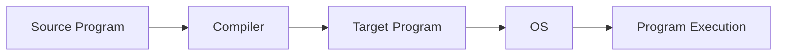
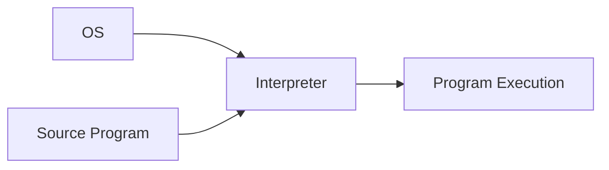
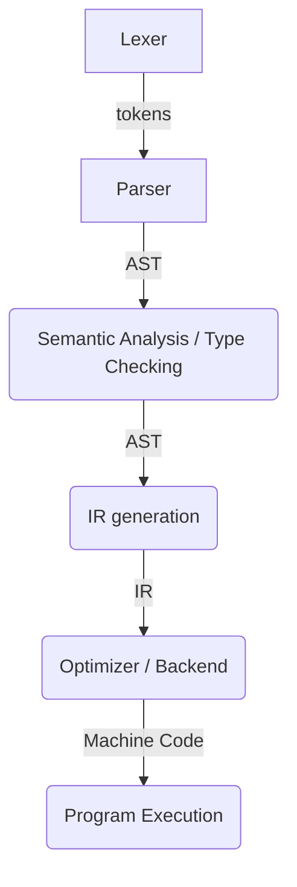

In this blog post, I'm going to cover another [John Crickett](https://github.com/JohnCrickett) [coding challenge](https://codingchallenges.substack.com/p/coding-challenge-30-lisp-interpreter) that I just completed - building a Lisp interpreter in Python. Lisp is the [second oldest](https://en.wikipedia.org/wiki/Lisp_(programming_language)) high-level language implemented (in 1959, after FORTRAN in 1957), probably most well-known for its fully parenthesized prefix notation (that definitely takes some getting used to). Scott Wlaschin calls Lisp a "galaxy brain" language for introducing the symbolic programming paradigm (if you haven't watched his talk linked [here](https://www.youtube.com/watch?v=0fpDlAEQio4) I highly recommend it). This coding challenge has definitely been the most challenging to date - I had to spend a few hours just familiarizing myself with Lisp syntax so that I could understand it enough to cobble together an implementation with basic features. 

For some interesting historical context on Lisp, and some thoughts on why, perhaps, Lisp is not more popular today, you can read ["Lisp: Good News, Bad News, How to Win Big"](https://dreamsongs.com/WIB.html) by Richard P. Gabriel.

## Programming Language Implementation

To begin, I think it's helpful to clarify what we mean by "programming language implementation," and differentiate between compilers and interpreters. 

Both compilers and interpreters implement programming languages, but they differ in their implementation strategy. A compiler's primary task is *translation* of a source program (typically written in a high-level language) into a target program (typically expressed in a low-level language). Later, the OS of the target machine helps to load and execute the target program [(Clarkson, ch. 9.0)](https://cs3110.github.io/textbook/chapters/interp/intro.html).



An interpreter's primary task is *execution*. It takes as input a source program and directly executes that program without producing machine code. In this case, the OS actually loads and executes the interpreter, and the interpreter is responsible for executing the program. *Typically*, an interpreter is easier to implement than a compiler [(Clarkson, ch. 9.0)](https://cs3110.github.io/textbook/chapters/interp/intro.html). 



## Compiler Phases

A compiler goes through several phases as it translates a program. At a high-level, a compiler must process the syntax and semantics of the source program, perform type checking, and then transform the source code into machine code so that it can be executed by the target platform. By *syntax*, we mean the rules that define what constitutes a textually well-formed program in the source language, to include operators, keywords, whitespace, formatting, and the like. By *semantics*, we mean the rules that define the behavior of the program. This includes both static and dynamic semantics, where dynamic semantics define the run-time behavior of the program, and static semantics define the compile-time checking that is done (including type checking) [(Clarkson, ch. 2.0)](https://cs3110.github.io/textbook/chapters/basics/intro.html).

Overall, it looks something like this:





### Lexing

Lexer generators are built on the theory of deterministic finite automata. These automata accept *regular languages*, which can be described with *regular expressions* [(Cooper & Torczon, ch. 2)](https://dl.acm.org/doi/pdf/10.5555/2737838]). During lexing, the compiler transforms the original source code from a sequence of characters to a sequence of tokens, which is then fed into the next phase of compilation, the parser. Typically we define a token as a <token class, lexeme> pair, like so:
```
token = <token class, lexeme> = <INT, "42">
```

The lexer does this by examining every input sequence, and then for each sequence of characters, the automaton (lexer tool) either recognizes and accepts the sequences of characters as a valid token, or rejects the input sequence as an invalid token [(Clarkson, ch. 9.2.1)](https://cs3110.github.io/textbook/chapters/interp/parsing.html).

The source code for a lexer is essentially a big `switch` statement, but instead of writing it by hand, there are many tools available that take a ruleset as input, and generate the source code for you that implements the lexer. More specifically, the input to a lexer generator is a collection of regular expressions that describe the tokens of the language, i.e., that specify the lexical analyzer. The output is the automaton (i.e., source code) that actually implements the specified lexical analyzer in a high-level language such as C (for lex/flex) or OCaml (for ocamllex) [(Clarkson, ch. 9.2.1)](https://cs3110.github.io/textbook/chapters/interp/parsing.html).

> For a much more in-depth theoretical treatment of this subject, I recommend the book [Engineering a Compiler](https://dl.acm.org/doi/pdf/10.5555/2737838), which is available for free online.
{: .prompt-tip }

> As briefly noted above, common software tools for this process include [Lex](https://en.wikipedia.org/wiki/Lex_(software)) or [Flex](https://en.wikipedia.org/wiki/Flex_(lexical_analyser_generator)) or [ocamllex](https://v2.ocaml.org/manual/lexyacc.html).
{: .prompt-info }

### Parsing

Parser generators are also built on the theory of automata, but they use *pushdown automata* which are like the finite automata used for lexers, but they also maintain a stack on which they can push and pop symbols. This stack allows pushdown automata to accept a bigger class of languages, which are known as *context-free languages* (CFLs). Just as regular languages can be expressed with a special notation (regular expressions), CFLs can be described with *context-free grammars* (CFGs). A context-free grammar is a set of *production rules* that describe how one symbol can be replaced by other symbols [(Clarkson, ch. 9.2.2)](https://cs3110.github.io/textbook/chapters/interp/parsing.html).

The standard notation for specifying a CFG is *Backus-Naur Form* (BNF). The input to a parser generator is typically a BNF description of the source language's syntax. The output of the parser generator is a program that recognizes the language of the grammar. This program then expects as input the output from the lexer (tokens), and as output, produces an abstract syntax tree (AST) [(Clarkson, ch. 9.2.2)](https://cs3110.github.io/textbook/chapters/interp/parsing.html). 

As the name suggests, this tree structure abstracts away from the concrete syntax of the source language to a more general, tree-like representation. Here a few examples.

For `1 + (2 + 3)` we can drop the parentheses and indicate that the right hand side should be evaluated first through a tree, like so:
```
  +
 / \
1   +
   / \
  2   3
```
and for the list `[1; 2; 3;]` (using OCaml syntax) we can drop the square brackets and semicolons and represent it as a tree like so:
```
    list 
   /  |  \
  1   2   3
```

Therefore, an AST allows us to represent the structure of a program at a level that is easier for the compiler to manipulate [(Clarkson, ch. 9.0)](https://cs3110.github.io/textbook/chapters/interp/intro.html).

> Again, for a much more in-depth theoretical treatment of pushdown automata, CFLs, CFGs, and BNF, I recommend the book [Engineering a Compiler](https://dl.acm.org/doi/pdf/10.5555/2737838), which is available for free online.
{: .prompt-tip }

> Common parser generator tools include [Yacc](https://en.wikipedia.org/wiki/Yacc), [Bison](https://www.gnu.org/software/bison/), [Lark](https://lark-parser.readthedocs.io/en/stable/) (for Python), and [Menhir](https://gallium.inria.fr/~fpottier/menhir/) (for OCaml).
{: .prompt-info }

### Semantic Analysis (including Type Checking)

After lexing and parsing, the next phase of compilation is semantic analysis, and the primary task of semantic analysis is type checking. To be specific, a *type system* is a mathematic description of how to determine whether an expression is ill-typed or well-typed. A *type checker* is a program that implements a type system, i.e., implements the static semantics of the language [(Clarkson, ch. 9.5)](https://cs3110.github.io/textbook/chapters/interp/typecheck.html). 

### Lowering to Intermediate Representation (IR)

Michael Clarkson says it best in his book "OCaml Programming: Correct + Efficient + Beautiful", so I'll just quote him directly here for this section:

"After semantic analysis, a compiler could immediately translate the AST (augmented with symbol tables) into the target language. But if the same compiler wanted to produce output for multiple targets (e.g., for x86 and ARM and MIPS), that would require defining a translation from the AST to each of the targets. In practice, compilers typically don’t do that. Instead, they first translate the AST to an intermediate representation (IR). Think of the IR as a kind of abstraction of many assembly languages. Many source languages (e.g., C, Java, OCaml) could be translated to the same IR, and from that IR, many target language outputs (e.g., x86, ARM, MIPS) could be produced.

An IR language typically has abstract machine instructions that accomplish conceptually simple tasks: loading from or storing to memory, performing binary operations, calling and returning, and jumping to other instructions. The abstract machine typically has an unbounded number of registers available for use, much like a source program can have an unbounded number of variables. Real machines, however, have a finite number of registers, which is one way in which the IR is an abstraction." [(Clarkson, ch. 9.0)](https://cs3110.github.io/textbook/chapters/interp/intro.html)

I'll add that another advantage of lowering the type-checked AST to IR is that we can leverage existing softwares like [MLIR](https://mlir.llvm.org/) or [LLVM](https://llvm.org/) to optimize and generate the target code for us. These existing softwares allow different compiler projects to focus on building a front end for their language, and use a shared optimizer and backend to generate machine code. Since LLVM is a massive open source project, you know you're getting a highly tuned optimizer for your compiler, allowing you to focus more of your efforts on designing the front end of the compiler. One of many nice overviews of LLVM and its use can be found [here](https://aosabook.org/en/v1/llvm.html).

### Target Code Generation

Finally, the last phase of compilation is generating target code from the IR. In this phase, we select concrete machine instructions to target, and which variables to store in memory (slow to access) vs. processor registers (fast to access but limited in number). As part of code generation, a compiler will always attempt some optimizations to maximize the performance of the code. Some examples include loop unrolling, eliminating dead code, replacing a function call with the function body itself, or re-ordering machine instructions [(Clarkson, ch. 9.0)](https://cs3110.github.io/textbook/chapters/interp/intro.html).

## About My Final Program
Circling back now to my project: `py-lisp-interpreter` is a basic Lisp interpreter, written in Python. Running `pylisp` from the command line will allow the user to enter the Lisp REPL environment, or execute a .txt file from a provided file path. 

## Type Definitions

In the header of our .py file containing our interpreter, we'll be explicit about our Lisp types:

```python
Symbol = str            # Implement a Lisp Symbol as a Python str
Number = (int, float)   # Implement a Lisp Number as a Python int or float
Atom = (Symbol, Number) # Implement a Lisp Atom as a Symbol or Number
List = list             # Implement a Lisp List as a Python list
Exp = (Atom, List)      # Implement a Lisp expression as an Atom or List
```

(Thanks to [Peter Norvig](https://norvig.com/lispy.html) for helping me conceptualize how to relate Lisp and Python types).

## Lexer

As discussed earlier, depending on the syntax of a programming language, implementing a lexer can be quite complicated. In this case, however, thanks to Lisp's syntax, and the beauty of Python, all we need to tokenize the input for our simple Lisp interpreter is `str.split()`:

```python 
def tokenize(input: str) -> List[str]:
    """
    Split input string into a list of tokens. Note that we pad
    parentheses with white space before splitting to separate
    parentheses from Atoms
    --> we want '(+ 1 2)' to tokenize to ['(', '+', '1', '2', ')']
    not ['(+', '1', '2)']
    """

    tokenized_input: List[str] = input.replace("(", " ( ").replace(")", " ) ").split()
    return tokenized_input
```

## Parser

Once we've tokenized the input source program, we can generate an abstract syntax tree (AST). We'll use Python lists to express the AST, and lists of lists to denote nested expressions:

```python
def generate_ast(tokens: List) -> List:
    """
    Generate abstract syntax tree from input tokens.

    Example:
    tokenized_input = ['(', 'defun', 'doublen', '(', 'n', ')', '(', '*', 'n', '2', ')', ')']
    -->
    ast = ['defun', 'doublen', ['n'], ['*', 'n', 2]]
    """
    t = tokens.pop(0)

    # start a new sublist everytime we encounter an open parens
    if t == "(":
        ast = []
        # append tokens to sublist until we encounter a close parens
        while tokens[0] != ")":
            ast.append(generate_ast(tokens))
        tokens.pop(0)  # pop off ')'
        return ast
    elif t == ")":
        raise SyntaxError("Mismatched parens.")
    else:
        return atomize(t)

def atomize(token: str) -> Atom:
    """
    Atomize input tokens. Every token is either an int, float, or Symbol.

    Note that
        Symbol := str
        Number := (int, float)
        Atom   := (Symbol, Number)
    """
    try:
        return int(token)
    except ValueError:
        try:
            return float(token)
        except ValueError:
            return Symbol(token)
```

## Evaluation

Once we have the AST, we are ready to evaluate the program! To do this, we need to be able to look up symbols in a mapping from variable name to value. We will call this our `SymbolTable`. We also need to make sure we support locally declared variables. To do this, we will allow for nested mappings, and when we need to look up a variable name in the `SymbolTable`, we can just look up the variable in the innermost mapping, then work outwards until we reach the global scope. 

To implement `SymbolTable`, we will inherit from the Python dict class, and define our own `find` method to check the appropriate scope for where variables are defined. 

```python
import operator as op
import math

class SymbolTable(dict):
"""
A mapping of {variable name: value}
"""
    def __init__(self, params=[], args=[], outer_scope=None):
        self.update(zip(params, args))
        self.outer_scope = outer_scope

    def find(self, var):
        if var in self:
            return self[var]
        elif self.outer_scope is not None:
            return self.outer_scope.find(var)
        else:
            raise NameError(f"NameError: name '{var}' is not defined")


global_symbol_table = SymbolTable()
global_symbol_table.update(
    {
        "+": op.add,
        "-": op.sub,
        "*": op.mul,
        "/": op.truediv,
        "<=": op.le,
        "<": op.lt,
        ">": op.gt,
        ">=": op.ge,
        "!=": op.ne,
        "=": op.eq,
    }
)
# add standard math library operators to symbol_table
global_symbol_table.update(math.__dict__)
```

Now that we have our `SymbolTable` for keeping track of variables in different scopes, we are ready to evaluate:

```python
def eval(x: Exp, st=global_symbol_table):
    """Evaluate the abstract syntax tree"""
    if isinstance(x, Number):
        return x
    elif isinstance(x, Symbol):
        # start with the innermost scope of the symbol table
        # to find symbol definition, searching outer scope until
        # symbol definition is found
        return st.find(x)
    elif x[0] == "if":
        condition, statement, alternative = x[1:4]
        expression = (
            statement
            if eval(condition, SymbolTable(st.keys(), st.values(), st))
            else alternative
        )
        return eval(expression, SymbolTable(st.keys(), st.values(), st))
    elif x[0] == "defun":
        # `func_name`: str
        # `params`: List[str]
        # `func_body`: List
        # Example:
        #   "(defun doublen (n) (* 2 n))" -->
        #   `func_name`: "doublen"
        #   `params`: ["n"]
        #   `func_body`: ["*", 2, "n"]
        func_name, params, func_body = x[1:4]
        st[func_name] = (params, func_body)
        return f"Defined function: {func_name.upper()}"
    elif x[0] == "format":
        if isinstance(x[-1], list):
            fill_val = eval(x[-1], SymbolTable(st.keys(), st.values(), st))
            res = " ".join(str(i) for i in x[2:-1])
        else:
            fill_val = ""
            res = " ".join(str(i) for i in x[2:])
        if "~D~%" in res:
            res = res.replace('"', "").replace("~D~%", str(fill_val))
        else:
            res = res.replace('"', "").replace("~%", str(fill_val))
        return res
    else:
        func_name = x[0]
        func = eval(x[0], SymbolTable(st.keys(), st.values(), st))
        args = [eval(arg, SymbolTable(st.keys(), st.values(), st)) for arg in x[1:]]

        # if `func` is a tuple, it is a user defined function, so update local scoping
        # of symbol table with user-provided parameters
        if isinstance(func, tuple):
            params, func_body = func
            if len(args) != len(params):
                raise ValueError(
                    f'Function "{func_name}" expects {len(params)} arguments, but {len(args)} were provided.'
                )
            st.update(zip(params, args))
            return eval(func_body, SymbolTable(st.keys(), st.values(), st))
        elif isinstance(func, (int, float, str)):
            return func
        else:
            return func(*args)
```

## Instructions
For Windows, create a folder named `Aliases` in your C drive: `C:/Aliases`. Add this folder to PATH. Next, create a batch file that will execute when you call the specified alias. For example, on my machine, I have a batch file named `pylisp.bat` located at `C:/Aliases`, that contains the following script:

```bat
@echo off
echo.
call C:\...\py-lisp-interpreter\pylisp_venv\Scripts\activate.bat
python C:\...\py-lisp-interpreter\main.py %*
```

So now, when I type `pylisp` in the command prompt, this batch file will execute, which in turn, launches the appropriate Python virtual environment, then runs the `py-lisp-interpreter` Python script. 

## Examples

Running `pylisp` from the command line launches a cli option to enter the REPL environment or execute a local file:

```cmd
C:\> pylisp

[?] Would you like to open the REPL environment, or execute a file?: file
 > file
   REPL

Enter the location of the file: test_script.txt
Defined function: HELLO
Defined function: MEANING_OF_LIFE
Defined function: MEANING_OF_LIFE_ANSWER
Defined function: DOUBLEN
Defined function: FIB
Defined function: FACT
Hello Coding Challenge World
42
The meaning of life is 42
The double of 5 is 10
The double of 21 is 42
The double of 107 is 214
Factorial of 5 is 120
Factorial of 6 is 720
Factorial of 7 is 5040
Factorial of 10 is 3628800
Factorial of 12 is 479001600
The 7th number of the Fibonacci sequence is 13
```

After running a local file, the user is then prompted to enter another file to execute, or they can exit the program:

```cmd
[?] Would you like to execute another file?: No
   Yes
 > No
```

If the user chooses to enter the REPL environment, they can then execute simple Lisp expressions:

```cmd
C:\> pylisp

[?] Would you like to open the REPL environment, or execute a file?: REPL
   file
 > REPL

pylisp> (+ 21 21)
42
pylisp> (pow 2 3)
8.0
pylisp> (sin (/ pi 2) )
1.0
pylisp> (sin (/ pi 4) )
0.7071067811865476
pylisp> (defun fact (n) (if (<= n 1) 1 (* n (fact (- n 1)))))
Defined function: FACT
pylisp> (fact 5)
120
pylisp> (fact 10)
3628800
pylisp> (defun add (a b) (+ a b))
Defined function: ADD
pylisp> (add 4 5)
9
pylisp> (add (add 21 21) 42 )
84
pylisp> (add (add 21 21) (fact 5) )
162
```

## Libraries
Just like the `py-wc` and `py-head` projects, everything I needed for `py-lisp-interpreter` was included in Python's Standard Library. For a little more cli functionality, I installed `inquirer`.

## Final Thoughts

This was the most difficult coding challenge for me thus far. I learned a lot about the Lisp programming language, and really came to appreciate it's syntax. Implementing the `eval` function to evaluate the AST proved to be more involved and nuanced than I first thought, and improved my ability to "think recursively."

Finally, if you check my repo for this project, you'll see that I implemented two helper functions that both check if the Lisp program is valid before executing. Specifically, they check if the program has matching parentheses (if parens are not balanced, it is not a valid program). 

For me, using a stack to add and pop parens as we scan the source code was the intuitive way to check balanced parens. After implementing that approach, I enjoyed thinking of a way to solve the same problem in a "functional" paradigm. The below function uses transform (map) reduce to do so. Specifically, `(` get transformed to `1`, `)` get transformed to `-1`, and every other character gets mapped to `0`. Now we can just apply a simple reduction with the `+` operator, and if the result is equal to `0`, we know we had balanced parens in the input source code.

```python
def are_parens_matched_map_reduce(s: str) -> bool:
    """
    A more functional approach to check that all parens are matching.
    Uses built-in Python `map` and `reduce` functions.

    Raises:
        SyntaxError: If `s` is empty or if `s` does
        not have matching opened and closed parentheses
    """
    t: List = tokenize(s)
    if len(t) == 0:
        raise SyntaxError(f"Input string cannot be empty.")
    # make sure that user input starts and end with open/close parens
    elif t[0] != "(" or t[-1] != ")":
        raise SyntaxError(
            f'Input string "{s}" must start and end with open/closed parens.'
        )

    ### transform-reduce
    # transform (map) open parens to 1, close parens to -1,
    # and all other chars to 0, then sum the resulting iterator
    # if all parens are matched, res will be 0, otherwise, throw
    # a SyntaxError, because there are mismatched parens
    d = {"(": 1, ")": -1}
    res = reduce(lambda a, b: a + b, map(lambda x: d.get(x, 0), t))
    if res != 0:
        raise SyntaxError(f'Input string "{s}" contains mismatched parens.')
    else:
        return True
```

## Acknowledgements
Thanks to [John Crickett](https://github.com/JohnCrickett) for the idea from his site, [Coding Challenges](https://codingchallenges.substack.com/p/coding-challenge-30-lisp-interpreter)!

Acknowledge here (https://norvig.com/lispy.html) - thanks for helping me when I got stuck, especially in setting up my symbol table for appropriately tracking scope. 

If you happen to peruse my code and notice any bugs or opportunities for optimizations, please let me know!
