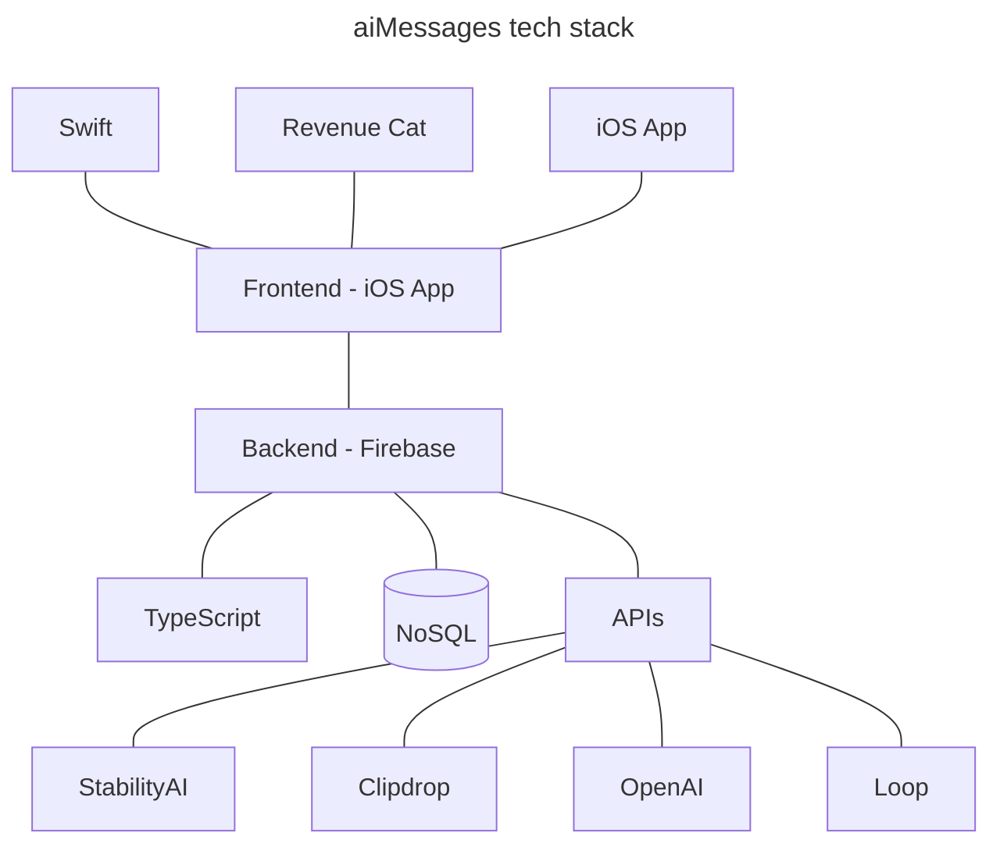

## TL;DR
If you want to skip around, here are the links to my other blog posts in this series:

[Using TypeScript](https://lwcarani.github.io/posts/aimessages-reflections-2/) (Blog series [Part 2](https://lwcarani.github.io/posts/aimessages-reflections-2/))

[LoopMessage API](https://lwcarani.github.io/posts/aimessages-reflections-3/) (Blog series [Part 3](https://lwcarani.github.io/posts/aimessages-reflections-3/))

[OpenAI API](https://lwcarani.github.io/posts/aimessages-reflections-4/) (Blog series [Part 4](https://lwcarani.github.io/posts/aimessages-reflections-4/))

[Stability AI and Clipdrop APIs](https://lwcarani.github.io/posts/aimessages-reflections-5/) (Blog series [Part 5](https://lwcarani.github.io/posts/aimessages-reflections-5/))

[Firebase](https://lwcarani.github.io/posts/aimessages-reflections-6/) (Blog series [Part 6](https://lwcarani.github.io/posts/aimessages-reflections-6/))

[Review](https://lwcarani.github.io/posts/aimessages-reflections-7/) (Blog series [Part 7](https://lwcarani.github.io/posts/aimessages-reflections-7/))

## Overview

In March of 2023, I partnered with my good friend [Jake Taylor](https://github.com/jakee417/) to build an iOS App that did two things:
1. Bring the ChatGPT "Large Language Model" (LLM) experience to iMessage (both in private and group chats)
2. Allow users to generate photo-realistic images with generative AI via an iMessage Extension App

In our infinite cleverness, we named this app ["aiMessages"](https://sites.google.com/view/aimessagesapp/home). We launched on the Apple App Store June 2023 and at the time of writing this post (May 2024) it is still available for [download](https://apps.apple.com/us/app/id6446336518). 

As I continue to learn and grow as a software developer / engineer, I try to consume information from a variety of sources: textbooks, online courses, podcasts, blogs, etc., but I've always found that the most effective form of learning for me is through actually building real software. This project was no exception. Most (if not all) parts of our final tech stack I had never used before this project. Building this app with Jake was deeply satisfying (and at times addicting), and through the process I grew as a software engineer. 

For scalability, we chose to use [Firebase](https://firebase.google.com/), an app development platform backed by Google. We integrated [RevenueCat](https://www.revenuecat.com/) to simplify user payments, which was much simpler than using the `StoreKit` API. For sending LLM / ChatGPT responses back to users via iMessage, we used [LoopMessage](https://loopmessage.com/server), an iMessage API for sending blue text messages to iMessage users. For generating photo-realistic images with generative AI, we used [Stability AI's](https://stability.ai/) stable diffusion text-to-image and inpainting models, and [Clipdrop's](https://clipdrop.co/) sketch-to-image model. For the AI chatbot / LLM experience, we used [OpenAI's](https://chatgpt.com/) ChatGPT model. Finally, we decided to use Google Cloud Functions (which are integrated into Firebase) to develop and deploy our serverless execution environment, and subsequently all of our backend code is written in [Typescript](https://www.typescriptlang.org/). I will discuss each of these technologies / APIs in more detail in later blog posts. 

> When Jake and I first began development on the app in March 2023, there was only Cloud Functions (1st gen), which required that we write and deploy Typescript code. Cloud Functions (2nd gen) has since been released, which allows you to write and deploy functions using Python (among other improvements). I have several years of Python experience so given the choice, I probably would have chose to write the backend code in Python, but I'm glad I was forced to learn Typescript, because it was fun learning a new language (albeit still an object-oriented one).
{: .prompt-info }

I learned so many valuable lessons and techniques relevant to software engineering by working on this app over the last year. 
- I got a lot of practice writing really robust, defensive code, trying to think through every edge case for every user action I might have to handle. 
- I gained exposure to and experience in test-driven development (TDD), writing hundreds and hundreds of unit tests. 
- Idempotent coding was a new concept for me, and I got to implement idempotent code to ensure we didn't double-charge users for their purchases. 
- I learned how to use bearer tokens with our cloud functions to authenticate incoming [webhooks](https://www.redhat.com/en/topics/automation/what-is-a-webhook). 
- I used NoSQL databases for the first time (which I really enjoyed), and now better understand the trade-offs between traditional, relational databases and NoSQL. 
- I got to work closely with Jake, communicating daily to work on how the client and server systems would communicate and work together in a seamless way to handle iMessage, data storage and retrieval, client authentication, and the like. 
- I had to think strategically about deploying code and adding new features in a way that maintained reverse compatibility with the frontend app versions: making sure that backend upgrades wouldn't break functionality for users on old versions of the iOS app, while allowing users who downloaded the new version of the iOS app to benefit from new backend features. 
- I had to consider the trade-offs of building for long-term scalability with growing more users (and managing a huge server load) with just shipping a product "now" before we had any users, but that we knew was ready to deploy. 
- And finally, I learned that you don't always have to write perfectly modularized, abstract, reusable, clean code, sometimes it just has to work (especially if the backend dev team is just one person).

Indisputably, the biggest takeaway from this project was finding my true passion for software engineering, and realizing that this is the career I want to pursue full-time when I separate from the military. 

One moment in particular stands out to me. During the first week of tinkering with the overall system design of this project, I was playing around with connecting the LoopMessage API, Firebase serverless cloud functions, and the OpenAI ChatGPT API. I wrote and deployed a basic Firebase Google cloud function that: 
1. Validated any incoming webhooks by authenticating the sending source (bearer token)
2. Called the OpenAI ChatGPT API with the text from the body of the webhook
3. Received the ChatGPT API response, then returned the response back to the client.

To test it, I sent a client URL ([cURL](https://developer.ibm.com/articles/what-is-curl-command/)) POST request from my PC to our Firebase Google cloud functions server endpoint that was running my deployed code. The server endpoint received the webhook, validated that it was an authenticate webhook (via the bearer token), called the OpenAI API, generated the ChatGPT response, and sent the response back to my iPhone via the LoopMessage API....**AND IT WORKED!** Even though it was just a few dozen lines of code, I will never forget the absolute thrill I felt when the thing I had written actually behaved the way I intended the thing to behave. It was in that moment that I knew I wanted to become a professional software engineer. 

I look forward to explaining each of the other components of our tech stack for this app in more detail in future blog posts.

For a more in-depth review of the frontend of aiMessages, and a peak into some of the Swift code, you can check out the blog post written by my co-creator ([Jake Taylor](https://github.com/jakee417/)), located [here](https://jakee417.github.io/posts/my-ios-development_journey/#aimessages).

All of the code I wrote for the backend of the app can be found on my Github repo for the project, [here](https://github.com/lwcarani/aiMessages-backend-public).
