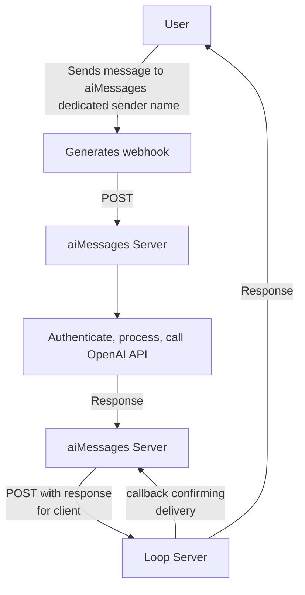

## Overview

One of the core functions of the aiMessage iOS app was to bring the LLM experience to iMessage, i.e., allowing iOS users to simply have a text message conversation with a large language model. To do this, we needed to use an iMessage API so that we could receive iMessages from the user, forward that message to an LLM API (we used OpenAI), and then send a response back to the user. Even though it was more expensive, we decided early on that we wanted an iMessage API instead of just SMS to make the experience feel more "legitimate." The experience felt "hackier" if you got a green bubble back on your iPhone/iPad. Blue bubbles (via an iMessage API) made the whole experience feel much cleaner and well-integrated. 

We used [LoopMessage](https://loopmessage.com/) (hereafter referred to simply as Loop) for aiMessages because it was reasonably priced, had decent API docs, and had a nice, easy to use sandbox environment that was free to use during our testing and development phase. 

> I believe [sendblue](https://sendblue.co/) is a viable alternative to Loop, if you're considering an iMessage API. 
{: .prompt-info }

## iMessage

The Loop API service allowed us to send blue text bubble messages to iMessage from our backend (serverless functions deployed to Firebase / Google Cloud Functions). Loop provides two-way iMessage texting, so that we could handle inbound texts from users and send outbound texts back to the user. It includes end-to-end encryption, and also allowed us to send and receive messages in private or group chats, send audio messages, send media attachments (images or video), display a typing indicator, show a read status, and send and receive reactions and effects on iMessages. 

The system worked as follows. 
1. A user sends an iMessage to a dedicated sender name (for the sandbox this was `sandbox.loopmessage.com@imsg.im`, once we launched, we purchased the dedicated sender name `aimessages@imsg.chat`).
2. Loop forwards a webhook/callback containing the information of the incoming message to a server URL that we previously registered. For our serverless cloud functions deployed with Google Firebase, this was something like `https://<location>-<app_id>.cloudfunctions.net/loopMessageWebhookHandler` (referred to below as "aiMessages server"). 
3. At this point, we used our private Loop API key and auth bearer token to authenticate the incoming webhook, and then process accordingly. For a text message, this would include passing the body of the message along to the OpenAI API to generate a response.
4. Next, we receive the response from OpenAI, package it up, and then send a POST request to Loop with the response so that they deliver a response back to the user.
5. Finally, we wait for a callback to ensure that the message was actually delivered to the user.  



> A webhook is an HTTP-based callback function that allows for event-driven communication between 2 APIs. At it's simplest, it's just a packet of information sent after some event, delivered in JSON format that contains keyed information that can easily be parsed and handled. For Loop, a webhook is generated and pushed to the designated server URL every time a certain event occurs. For iMessage, this included `message_inbound`, `message_sent`, `message_failed`, `message_scheduled`, `message_reaction`, `message_timeout`, and `group_created`, among others. This allowed us to deploy a series of functions and procedures that would execute whenever we received a particular webhook - like decrementing the number of credits a user has by 1 once we receive confirmation that our message sent from the backend was actually received by the client. 
{: .prompt-info }

### Function Triggers

The workhorse of our backend was a deployed function named `loopMessageWebhookHandler` that processed every single incoming webhook from Loop. We implemented a Pub/Sub service to efficiently respond to incoming webhooks (more on this in a later post), and then used a `switch` statement to quickly determine what type of webhook event was received, and how to respond (`message_inbound`, `message_sent`, `conversation_inited`, etc.). 

```ts
// index.ts
exports.loopMessageWebhookHandler = functions
  .runWith({
    secrets: [
      "LOOP_AUTH_BEARER_TOKEN",
    ],
  })
  .https
  .onRequest(async (request, response) => {
    // Get secret(s)
    const loopAuthBearerToken = process.env.LOOP_AUTH_BEARER_TOKEN ?? "";

    // Step 1.)
    // if request has proper auth header, immediately send 200 status code,
    // then commence processing
    const authHeader = request.get("authorization");
    const {statusCode, httpsResponseMessage} =
      verifyAuthHeader(authHeader, loopAuthBearerToken);
    console.log("Completed auth step!");

    // Set session_id and get alert_type of webhook
    const alertType: AlertType = request.body.alert_type ?? AlertType.UNKNOWN;
    let sessionId: string;
    // if sessionId is present in passthrough data of request body,
    // use that, otherwise, assign new sessionId to use for this webhook
    // Generally, passthrough.sessionId is present if this
    // is a "message_sent" webhook
    if ("passthrough" in request.body) {
      const passthroughData: string = request.body.passthrough ?? "";
      let passthroughDataJSON: any;
      if (passthroughData) {
        passthroughDataJSON = JSON.parse(passthroughData);
        sessionId = passthroughDataJSON.sessionId ?? "";
      } else {
        sessionId = "";
      }
    } else {
      sessionId = uuidv4();
    }

    // Log start of webhook processing
    const toLog: LoggingObject = {
      session_id: sessionId,
      event_type: LoggingEventType.INCOMING_WEBHOOK,
      event_provider: LoggingEventProvider.LOOP_MESSAGE,
      event_status: LoggingEventStatus.RECEIVED,
      http_info: alertType,
      http_type: 200,
    };
    console.log(JSON.stringify(toLog));

    // Publish loop webhook body to the Pub/Sub
    const pubsub = new PubSub();
    const topic = pubsub.topic("loop-webhook-process");
    const json = request.body;
    json["session_id"] = sessionId;
    const typing: number = (alertType === AlertType.MESSAGE_INBOUND) ? 5 : 0;

    // publish message, then once promise is resolved that
    // message has been published, return statusCode back to loop
    // if there is an error, send loop a 500 code so that they retry

    // Log start of Pub/Sub
    const toLogPubSub: LoggingObject = {
      session_id: sessionId,
      event_type: LoggingEventType.PUBLICATION,
      event_provider: LoggingEventProvider.LOOP_MESSAGE,
      event_status: LoggingEventStatus.REQUESTED,
      http_type: 200,
    };
    console.log(JSON.stringify(toLogPubSub));

    topic.publishMessage({json})
      .then((messageId) => {
        // Log Pub/Sub finish
        const toLogPubSub: LoggingObject = {
          session_id: sessionId,
          event_type: LoggingEventType.PUBLICATION,
          event_provider: LoggingEventProvider.LOOP_MESSAGE,
          event_status: LoggingEventStatus.COMPLETED,
          http_type: 200,
          http_info: messageId,
        };
        console.log(JSON.stringify(toLogPubSub));
        response.status(statusCode).send(
          {
            message: httpsResponseMessage,
            typing: typing,
            read: true,
          }
        );
      })
      .catch((error: any) => {
        console.log(error);
        // Log Pub/Sub failed (bad gateway)
        const toLogPubSub: LoggingObject = {
          session_id: sessionId,
          event_type: LoggingEventType.PUBLICATION,
          event_provider: LoggingEventProvider.LOOP_MESSAGE,
          event_status: LoggingEventStatus.FAILED,
          http_type: 502,
        };
        console.log(JSON.stringify(toLogPubSub));
        response.status(502).send("Error publishing message.");
      });
  });

exports.loopMessageWebhookHandlerPubSub = functions
  .runWith({
    secrets: [
      "LOOP_AUTH_SECRET_KEY",
      "LOOP_SECRET_API_KEY_FOR_CONVERSATION",
      "OPENAI_API_KEY",
    ],
  })
  .pubsub
  .topic("loop-webhook-process")
  .onPublish(async (message) => {
    // Get secret(s)
    const loopAuthSecretKey = process.env.LOOP_AUTH_SECRET_KEY ?? "";
    const loopAuthSecretKeyConvo =
      process.env.LOOP_SECRET_API_KEY_FOR_CONVERSATION ?? "";
    const openaiApiKey = process.env.OPENAI_API_KEY ?? "";
    // Initalize api managers
    const openaiApiManager = new OpenaiApiManager(openaiApiKey);
    const loopApiManager = new LoopApiManager(
      loopAuthSecretKey,
      loopAuthSecretKeyConvo
    );

    // message is just request.body from Loop webhook, parse accordingly
    const requestBodyData: any = message.json;
    const alertType: AlertType =
      requestBodyData.alert_type ?? AlertType.UNKNOWN;
    const messageRecipient: string = requestBodyData.recipient ?? "";
    const sessionId: string = requestBodyData.session_id ?? "";

    switch (alertType) {
    case AlertType.CONVERSATION_INITED: {
      console.log("Entering case statement for AlertType.CONVERSATION_INITED");
      await privateConversationInitedWebhookHandler(
        sessionId,
        messageRecipient,
        alertType,
        loopApiManager
      );
      break;
    }
    case AlertType.GROUP_CREATED: {
      console.log(
        "Entering case statement for AlertType.GROUP_CREATED"
      );
      const groupID: string = requestBodyData.group.group_id ?? "";
      await groupCreatedWebhookHandler(
        sessionId,
        messageRecipient,
        groupID,
        alertType,
        loopApiManager
      );
      break;
    }
    case AlertType.MESSAGE_SENT: {
      console.log("Entering case statement for AlertType.MESSAGE_SENT");
      await messageSentWebhookHandler(requestBodyData);
      break;
    }
    case AlertType.MESSAGE_FAILED: {
      console.log("Entering case statement for AlertType.MESSAGE_FAILED");
      await messageFailedOrTimeoutWebhookHandler(requestBodyData);
      break;
    }
    case AlertType.MESSAGE_TIMEOUT: {
      console.log("Entering case statement for AlertType.MESSAGE_TIMEOUT");
      await messageFailedOrTimeoutWebhookHandler(requestBodyData);
      break;
    }
    case AlertType.MESSAGE_INBOUND: {
      console.log("Entering case statement for AlertType.MESSAGE_INBOUND");
      const uid: string = await getUIDGivenIMessageAccount(
        messageRecipient,
        sessionId
      );
      if (!uid) {
        // If uid is null / empty at this point, incoming messageRecipient
        // is not a valid customer, exit control flow, do not send a response
        console.log("Exiting auth flow (no uid), no message response sent.");
        break;
      }
      const {
        isValidSubscription,
        hasValidMessagesRemaining,
        wasUserWarnedNoCreditsRemaining,
      } = await checkValidSubscriptionOrMessagesRemaining(dataManager, uid);

      if (
        !isValidSubscription &&
        !hasValidMessagesRemaining &&
        !wasUserWarnedNoCreditsRemaining
      ) {
        // If the customer does not have a valid description, and
        // if the customer does not have valid message tokens remaining,
        // exit control flow, do not send a response
        await loopApiManager.sendNotificationMessageToUserOutOfMessageCredits(
          dataManager,
          uid,
          sessionId
        );
        break;
      } else if (!isValidSubscription && !hasValidMessagesRemaining) {
        console.log("Exiting auth flow, no message response sent.");
        break;
      }

      if ("group" in requestBodyData) {
        // If valid account with active messages or subscription, proceed
        // Check if this is a group chat with incoming message
        console.log("Entering groupMessageHandler code block");
        await groupMessageHandler(
          requestBodyData,
          sessionId,
          uid,
          isValidSubscription,
          hasValidMessagesRemaining,
          loopApiManager,
          openaiApiManager
        );
      } else {
        // This is a private chat with incoming message
        console.log("Entering privateMessageHandler code block");
        await privateMessageHandler(
          requestBodyData,
          sessionId,
          uid,
          isValidSubscription,
          hasValidMessagesRemaining,
          loopApiManager,
          openaiApiManager
        );
      }
      break;
    }
    default: {
      console.log(
        "Entering default case statement for Loop Webhook Handler AlertType"
      );
      console.log(`Incoming alert didn't trigger a response: ${alertType}.`);
      console.log("Exiting auth flow, no message response sent.");
    }
    }
    // Log completion of webhook processing
    const toLog: LoggingObject = {
      session_id: sessionId,
      event_type: LoggingEventType.INCOMING_WEBHOOK,
      event_provider: LoggingEventProvider.LOOP_MESSAGE,
      event_status: LoggingEventStatus.COMPLETED,
      http_info: alertType,
      http_type: 200,
    };
    console.log(JSON.stringify(toLog));
    return null;
  });
```

### New Conversation

One of the really nice features of Loop's API was that we received a webhook event every time a new conversation was initiated, basically, a new customer. When this happened, we automatically sent a welcome message to the user thanking them for joining, and a link to a "how-to" video explaining all the features of the app.

Message:

```ts
// globals.ts
export const WELCOME_NEW_PRIVATE_USER: string =
  "Hello!!! 🥳🥳🥳 \n\n" +
  "I will only respond with text after you message me, and make sure " +
  "you're only charged for the messages I get back to you.\n\n" +
  "To generate images, launch the iMessage extension app below " +
  "👇 (I also sent a video to help you find it).\n\n" +
  "⚠️ Prepare to have fun!\n\n" +
  "Try asking me to write you a song, or recommend places to travel " +
  "based on your interests. I can also help with " +
  "professional or educational topics! " + WELCOME_VIDEO_URL;
```

Function for sending welcome message:
```ts
// handlers.ts

/**
 * if alertType === "conversation_inited", send a welcome message
 * after sending welcome message, exit control flow
 * @param {string} sessionId
 * @param {string} messageRecipient
 * @param {AlertType} alertType
 * @param {LoopApiManager} loopApiManager
 */
export async function privateConversationInitedWebhookHandler(
  sessionId: string,
  messageRecipient: string,
  alertType: AlertType,
  loopApiManager: LoopApiManager
): Promise<void> {
  const uid: string = await getUIDGivenIMessageAccount(
    messageRecipient,
    sessionId
  );
  const passthrough: string =
    `{"uid": "${uid}", ` +
    `"sessionId": "${sessionId}", ` +
    `"incomingMessageType": "${MessageType.PRIVATE_WELCOME_MESSAGE}"}`;
  try {
    await loopApiManager.sendLoopMessage(
      uid,
      sessionId,
      messageRecipient,
      undefined,
      WELCOME_NEW_PRIVATE_USER,
      alertType,
      undefined,
      passthrough
    );
  } catch (error: any) {
    console.log(
      "Failed to send private user welcome message.\n",
      error.message + "\n",
      error.cause
    );
  }
  return;
}
```

### Group Created

We also received a webhook every time a new group was created. Since anyone could start a new group, it did not necessarily mean that every user in the group had previously downloaded the app. We used this as an opportunity to say "hello" to everyone in the group, and provide a deeplink to redirect them to the Apple app store to download aiMessages, if they hadn't already.

Message:

```ts
// globals.ts
export const WELCOME_MESSAGE_NEW_GROUP: string =
  "Hello!!! I see a new group was created 😏\n\n" +
  "I will only respond if mentioned by name " +
  "(that's aiMessages if you haven't given me one yet), " +
  "to anyone with an aiMessages account.\n\n" +
  "Oh! And if you don't have the app yet, follow the link 👇 to get started! " +
  "https://apps.apple.com/us/app/aimessages/id6446336518";
```

Function for sending welcome message:

```ts
// handlers.ts

/**
 * if alertType === "group_created", send a welcome message
 * with a deeplink to appstore for aiMessages app download
 * after sending welcome message, exit control flow
 * @param {string} sessionId
 * @param {string} messageRecipient
 * @param {string} groupID
 * @param {AlertType} alertType
 * @param {LoopApiManager} loopApiManager
 */
export async function groupCreatedWebhookHandler(
  sessionId: string,
  messageRecipient: string,
  groupID: string,
  alertType: AlertType,
  loopApiManager: LoopApiManager
): Promise<void> {
  const uid: string = await getUIDGivenIMessageAccount(
    messageRecipient,
    sessionId
  );
  console.log("uid:", uid);
  const passthrough: string =
    `{"uid": "${uid}", ` +
    `"sessionId": "${sessionId}", ` +
    `"incomingMessageType": "${MessageType.GROUP_WELCOME_MESSAGE}"}`;
  try {
    await loopApiManager.sendLoopMessage(
      uid,
      sessionId,
      undefined,
      groupID,
      WELCOME_MESSAGE_NEW_GROUP,
      alertType,
      undefined,
      passthrough
    );
  } catch (error: any) {
    console.log(
      "Failed to send group created welcome message.\n",
      error.message + "\n",
      error.cause
    );
  }
  return;
}
```

### iMessage Sent

Once we received confirmation that the message was *sent* to the user, we could do things like charge them for the transaction. One of the properties that Loop includes in the `message_sent` webhook is a field `success` that is `true` if the message was successfully delivered to the user, and `false` otherwise. If `success` was `true`, then we would create a receipt and store it in our NoSQL database. The `message_sent` webhook includes the contact info for the user, but that's not enough to appropriately identify who the user is to charge them for the transaction. To overcome this, we included passthrough data in our POST requests that we sent to Loop, so that when we received the `message_sent` webhook confirming delivery, we could parse the passthrough data and identify the `uid` and other pertinent information of the user.

```ts
// handlers.ts

/**
 *
 * @param {any} requestBodyData
 */
export async function messageSentWebhookHandler(
  requestBodyData: any
): Promise<void> {
  // Initalize the data manager
  const dataManager = new DataManager();

  // extract data from request body
  const alertType: AlertType = requestBodyData.alert_type ?? AlertType.UNKNOWN;
  const messageDeliveredSuccessfully: boolean =
    requestBodyData.success ?? false;
  const passthroughData: string = requestBodyData.passthrough ?? "";

  let passthroughDataJSON: any;
  let uid: string;
  let sessionId: string;
  let incomingMessageType: string;
  let isValidSubscription: boolean;
  let hasValidMessagesRemaining: boolean;

  if (passthroughData) {
    passthroughDataJSON = JSON.parse(passthroughData);
    uid = passthroughDataJSON.uid ?? "";
    sessionId = passthroughDataJSON.sessionId ?? "";
    incomingMessageType = passthroughDataJSON.incomingMessageType ?? "";
    isValidSubscription = passthroughDataJSON.isValidSubscription ?? false;
    hasValidMessagesRemaining =
      passthroughDataJSON.hasValidMessagesRemaining ?? false;
  } else {
    console.log(
      "No uid or passthrough data present! Cannot charge user. BREAK!"
    );
    const toLog: LoggingObject = {
      session_id: "",
      event_type: LoggingEventType.INCOMING_WEBHOOK,
      event_provider: LoggingEventProvider.LOOP_MESSAGE,
      event_status: LoggingEventStatus.FAILED,
      http_info: alertType,
      http_type: 400,
    };
    console.log(JSON.stringify(toLog));
    return;
  }

  if (messageDeliveredSuccessfully) {
    // Begin switch statement to check how/if we should charge user
    switch (incomingMessageType) {
    case MessageType.PRIVATE_MESSAGE: {
      console.log("Charging user for private message.");
      await createReceiptForSuccessfulPrivateMessageDelivery(
        dataManager,
        requestBodyData,
        isValidSubscription,
        hasValidMessagesRemaining,
        uid
      );
      console.log(
        "Completed processing of 'message_sent' webhook for private message."
      );
      break;
    }
    case MessageType.GROUP_MESSAGE: {
      console.log("Charging user for group message.");
      await createReceiptForSuccessfulGroupMessageDelivery(
        dataManager,
        requestBodyData,
        isValidSubscription,
        hasValidMessagesRemaining,
        uid
      );
      console.log(
        "Completed processing of 'message_sent' webhook for group message."
      );
      break;
    }
    default: {
      console.log(
        "Not charging user since message was of type", incomingMessageType
      );
    }
    }
  } else { // !messageDeliveredSuccessfully
    console.log(
      "Message was not successfully delivered to user." +
      "Examples: your recipient blocked you or uses " +
      "filters from unknown senders, or user has an Android phone."
    );
    const toLog: LoggingObject = {
      uid: uid,
      session_id: sessionId,
      event_type: LoggingEventType.INCOMING_WEBHOOK,
      event_provider: LoggingEventProvider.LOOP_MESSAGE,
      event_status: LoggingEventStatus.FAILED,
      http_info: alertType,
      http_type: 400,
    };
    console.log(JSON.stringify(toLog));
  }
}
```

After calling either `createReceiptForSuccessfulPrivateMessageDelivery` or `createReceiptForSuccessfulGroupMessageDelivery` to generate a receipt for the user, another cloud function would automatically be triggered to actually charge the user for the transaction. If we generated a receipt for private message use, `chargeUserForPrivateMessageUse` would automatically be triggered (thanks to Firebase Cloud Functions `.onCreate` trigger), and likewise if we generated a receipt for group message use, `chargeUserForGroupMessageUse` would automatically be triggered.

To ensure idempotency, these functions would check the current docID against the last receipt that was generated to ensure we were not double charging users, and then decremented the number of message credits the user has remaining, and then updated the NoSQL database to reflect the new amount. 

```ts
// index.ts
exports.chargeUserForPrivateMessageUse = functions
  .firestore
  .document("/customerExpenses/{uid}/private/{documentID}")
  .onCreate(async (snap, context) => {
    // Grab the current value of what was written to Firestore
    const data: admin.firestore.DocumentData = snap.data();
    const chargeType: ChargeType | undefined =
      data.paidWithSubscriptionOrToken ?? undefined;
    const uid: string = context.params.uid ?? "";
    const docID: string = context.params.documentID ?? "";
    let {
      numberOfMessagesRemaining,
      latestReceipt,
    } = await getNumMessagesRemainingAndLatestReceipt(dataManager, uid);

    // check latest receipt to ensure idempotency
    if (docID === latestReceipt) {
      console.log(
        "Duplicate receipts found, already updated balance. Exiting."
      );
      return null;
    }

    if (chargeType === ChargeType.TOKEN) {
      numberOfMessagesRemaining--;
    }

    const dataToUpload: DocumentData = {
      numberOfMessagesRemaining: numberOfMessagesRemaining,
      wasUserWarnedNoCreditsRemaining: false,
      latestReceipt: docID,
    };
    try {
      return dataManager.setDocument(
        dataToUpload,
        Collection.CONSUMABLE_BALANCE,
        uid
      );
    } catch (error: any) {
      console.log(
        "Error during consumableBalance data upload: ",
        error.message
      );
      return null;
    }
  });

exports.chargeUserForGroupMessageUse = functions
  .firestore
  .document("/customerExpenses/{uid}/group/{documentID}")
  .onCreate(async (snap, context) => {
    // Grab the current value of what was written to Firestore
    const data: admin.firestore.DocumentData = snap.data();
    const chargeType: ChargeType | undefined =
      data.paidWithSubscriptionOrToken ?? undefined;
    const uid: string = context.params.uid ?? "";
    const docID: string = context.params.documentID ?? "";
    let {
      numberOfMessagesRemaining,
      latestReceipt,
    } = await getNumMessagesRemainingAndLatestReceipt(dataManager, uid);

    // check latest receipt to ensure idempotency
    if (docID === latestReceipt) {
      console.log(
        "Duplicate receipts found, already updated balance. Exiting."
      );
      return null;
    }

    if (chargeType === ChargeType.TOKEN) {
      numberOfMessagesRemaining--;
    }

    const dataToUpload: DocumentData = {
      numberOfMessagesRemaining: numberOfMessagesRemaining,
      wasUserWarnedNoCreditsRemaining: false,
      latestReceipt: docID,
    };
    try {
      return dataManager.setDocument(
        dataToUpload,
        Collection.CONSUMABLE_BALANCE,
        uid
      );
    } catch (error: any) {
      console.log(
        "Error during consumableBalance data upload: ",
        error.message
      );
      return null;
    }
  });
```

### iMessage Failure or Timeout

In the event that a message failed to deliver to the user, or timed out after too many attempts (effectively the same thing), we would simply log the event for later analysis.

```ts
// handlers.ts

/**
 *
 * @param {any} requestBodyData
 */
export async function messageFailedOrTimeoutWebhookHandler(
  requestBodyData: any
): Promise<void> {
  // extract data from request body
  const passthroughData: string = requestBodyData.passthrough ?? "";
  const passthroughDataJSON: any = JSON.parse(passthroughData);
  const uid: string = passthroughDataJSON.uid ?? "";
  const sessionId: string = passthroughDataJSON.sessionId ?? "";
  const alertType: AlertType = requestBodyData.alert_type ?? AlertType.UNKNOWN;
  const toLog: LoggingObject = {
    uid: uid,
    session_id: sessionId,
    event_type: LoggingEventType.INCOMING_WEBHOOK,
    event_provider: LoggingEventProvider.LOOP_MESSAGE,
    event_status: LoggingEventStatus.FAILED,
    http_info: alertType,
    http_type: 400,
  };
  console.log(JSON.stringify(toLog));
}
```

### iMessage Inbound

This portion of our backend codebase contained the most nuanced and complicated logic. When the aiMessages server received a `message_inbound` webhook from Loop, it meant that a user just sent us a new message. In this case, our priority was to minimize the latency in responding to the user, while also returning a useful, interesting, and entertaining result.

To this end, in the frontend iOS portion of the app, we allowed users to specify a name for their bot, as well as a personality, as a way to personalize the experience. This information was stored in our NoSQL database through Firebase, and we could quickly query this info when needed. The personality provided a small way to personalize the experience - if the user specified that their bot was a "cowboy," then the LLM might say "Yeehaw!..." to start every message. 

Below you can see two examples of the user selecting a personality for their chatbot. In the first example, the user selected "hamster" as the personality for their chatbot. In the second, they selected "Grinning," which you can see along with the personality description. 

{: .shadow } | {: .shadow } 

> Every emoji actually represented a different personality. So, to select a new personality for their bot, users just selected an emoji, and every emoji had a unique, pre-generated personality description associated with it. We actually used ChatGPT to generate all of the personalities associated with each emoji!
{: .prompt-info }

Finally, we also cached `N` previous messages from the user's conversation, to provide context to the LLM when generating new responses. `N` is set in `globals.ts`, and typically between `5` and `10`.

```ts
// globals.ts
export const MAX_MESSAGE_HISTORY: number = process.env.NODE_ENV === "test" ? 5 : 10;
```

Without this message caching, the LLM (in this case, OpenAI's API), would not be able to provide high fidelity responses. Each API call is independent, so there's no way for the OpenAI API to differentiate between users and "remember" the conversation. To achieve this experience, we would pass along the most recent messages from the user (along with what the LLM had previously responded) to provide context, improving the quality of responses. This was tricky, because we had to send enough previous messages to provide adequate context, while also ensuring we didn't exceed the max tokens for the model we were calling.

To illustrate this point, let's say you sent a text from your phone to aiMessages saying "What color are walruses?". The LLM then responds "Walruses are brown!". In a text message conversation, you want to be able to say, "and where do they live?", and you want the LLM to *know* that you are referring to walruses - you don't want to have to specify that every time. By providing the cached message history, that's exactly what we achieved with aiMessages. 

#### Private

Here's the entire `privateMessageHandler` function:

```ts
// handlers.ts

/**
 *
 * @param {any} requestBodyData
 * @param {string} sessionId
 * @param {string} uid
 * @param {boolean} isValidSubscription
 * @param {boolean} hasValidMessagesRemaining
 * @param {LoopApiManager} loopApiManager
 * @param {OpenaiApiManager} openaiApiManager
 */
export async function privateMessageHandler(
  requestBodyData: any,
  sessionId: string,
  uid: string,
  isValidSubscription: boolean,
  hasValidMessagesRemaining: boolean,
  loopApiManager: LoopApiManager,
  openaiApiManager: OpenaiApiManager
): Promise<void> {
  // Initialize the data manager
  const dataManager = new DataManager();

  // Grab parameters from Loop Webhook
  const messageRecipient: string = requestBodyData.recipient ?? "";
  const incomingUserMessage: string = requestBodyData.text ?? "";
  const alertType: AlertType = requestBodyData.alert_type ?? AlertType.UNKNOWN;

  // get the user-specified stored botName from Firebase Firestore
  let botName: string;
  try {
    const result = await dataManager.getDocument(
      Collection.BOT_NAMES,
      uid,
      undefined,
      undefined
    );
    botName = result?.botName ?? "aiMessages";
  } catch (error: any) {
    console.log("Error:", error.message);
    console.log("No botName found. Using default botName: \"aiMessages\"");
    botName = "aiMessages";
  }

  // get the user-specified stored personality from Firebase Firestore
  let personality: string;
  try {
    const result = await dataManager.getDocument(
      Collection.PERSONALITY,
      uid,
      undefined,
      undefined
    );
    personality = result?.prompt ?? "You are a helpful assistant.";
  } catch (error: any) {
    console.log("Error:", error.message);
    console.log("No personality found, using default " +
      "personality prompt: \"You are a helpful assistant.\"");
    personality = "You are a helpful assistant.";
  }
  // Add botName to the end of the personality prompt so that the LLM knows
  personality += ` Your name is ${botName}.`;

  // create the ChatCompletionRequestMessage array to send to OpenAIApi
  // Retrieve array of recent messages sent by user
  // and recent messages responses sent by assistant (i.e., ChatGPT)
  let userMessagesArr: string[];
  let assistantMessagesArr: string[];
  try {
    const result = await dataManager.getDocument(
      Collection.CACHED_PRIVATE_MESSAGES,
      uid,
      undefined,
      undefined
    );
    userMessagesArr = result?.cachedUserMessages ?? [];
    assistantMessagesArr = result?.cachedAssistantMessages ?? [];
  } catch (error: any) {
    console.log("Error:", error.message);
    userMessagesArr = [];
    assistantMessagesArr = [];
  }

  // if the userMessagesArr and assistantMessagesArr are the same length,
  // update array of userMessages by appending new message to end
  // of the array. Now userMessages array should be
  // +1 the length of assistantMessages array, so that we can properly
  // format it to send to OpenAI ChatCompletion API
  if (userMessagesArr.length === assistantMessagesArr.length) {
    userMessagesArr.push(incomingUserMessage);
  } else if (userMessagesArr.length === assistantMessagesArr.length + 1) {
    // If the cached userMessagesArr length is +1 the length of
    // cached assistantMessagesArr, then we append the incoming message
    // to the last element of userMessagesArr, since the number of messages
    // is already appropriate for formatting for the OpenAIApi call
    userMessagesArr[userMessagesArr.length - 1] += ` ${incomingUserMessage}`;
  }

  // format "messages" parameter to send to OpenAIApi
  // Note that userMessagesArr must always have (length + 1) of whatever
  // assistantMessagesArr's length is, since the format for an OpenAIApi
  // message is [{user:}, {assistant:}, {user:}, {assistant:}, ..., {user:}]
  // typically this means assistantMessagesArr is length MAX_MESSAGE_HISTORY
  // (imported from constants.ts)
  // and userMessagesArr is length MAX_MESSAGE_HISTORY + 1
  const {messages, numTokensRequired} = formatOpenAIApiMessages(
    assistantMessagesArr,
    userMessagesArr,
    personality
  );

  // Try to generate a response via OpenAI's API.
  // Exponential backoff is implemented inside the
  // generateResponseToMessage function call.
  // If OpenAI API continues to return HTTPS error messages
  // send a message to the user to try again
  let assistantMessageResponse = "";
  let errorMessage = "";
  try {
    assistantMessageResponse =
      await openaiApiManager.generateResponseWithOpenAiChatCompletionApi(
        uid,
        sessionId,
        messages,
        numTokensRequired,
        uid,
        0
      );
  } catch (error: any) {
    errorMessage = error.message;
  }
  // send response back to user
  // Exponential backoff is implemented inside sendLoopMessage function call.
  // If Loop continues to return HTTPS error messages nothing is sent to user.
  if (assistantMessageResponse) {
    try {
      const passthrough: string =
        `{"uid": "${uid}", ` +
        `"sessionId": "${sessionId}", ` +
        `"incomingMessageType": "${MessageType.PRIVATE_MESSAGE}", ` +
        `"isValidSubscription": ${isValidSubscription}, ` +
        `"hasValidMessagesRemaining": ${hasValidMessagesRemaining}}`;
      await loopApiManager.sendLoopMessage(
        uid,
        sessionId,
        messageRecipient,
        undefined,
        assistantMessageResponse,
        alertType,
        undefined,
        passthrough
      );
    } catch (error: any) {
      console.log(
        "Error with sending message via loop.\n",
        error.message + "\n",
        error.cause
      );
    }
  } else {
    try {
      const passthrough: string =
        `{"uid": "${uid}", ` +
        `"sessionId": "${sessionId}", ` +
        `"incomingMessageType": "${MessageType.PRIVATE_ERROR_MESSAGE}", ` +
        `"isValidSubscription": ${isValidSubscription}, ` +
        `"hasValidMessagesRemaining": ${hasValidMessagesRemaining}}`;
      await loopApiManager.sendLoopMessage(
        uid,
        sessionId,
        messageRecipient,
        undefined,
        errorMessage,
        alertType,
        undefined,
        passthrough
      );
    } catch (error: any) {
      console.log(
        "Error with sending message via loop.\n",
        error.message + "\n",
        error.cause
      );
    }
  }
  // if we receive an OpenAi Api response,
  // add the new assistant response to recent assistant messages array
  // if we now exceed MAX_MESSAGE_HISTORY, it will get trimmed below
  // when we call the `verifyLengthAndTrimMessagesArray` helper function
  if (assistantMessageResponse) {
    assistantMessagesArr.push(assistantMessageResponse);

    // make sure message arrays are proper lengths before updating
    userMessagesArr =
      verifyLengthAndTrimMessagesArray(userMessagesArr);
    assistantMessagesArr =
      verifyLengthAndTrimMessagesArray(assistantMessagesArr);
  }

  // push updated arrays to Firebase Firestore
  const cachedDataToUpload: DocumentData = {
    cachedUserMessages: userMessagesArr,
    cachedAssistantMessages: assistantMessagesArr,
  };

  try {
    await dataManager.setDocument(
      cachedDataToUpload,
      Collection.CACHED_PRIVATE_MESSAGES,
      uid,
      undefined,
      undefined
    );
    console.log("cachedPrivateMessages Array successfully " +
      "uploaded to Firestore.");
  } catch (error: any) {
    console.log(
      "Error during cachedPrivateMessages data upload:",
      error.message
    );
  }
}
```

Going through step by step, you can see that first we grab the `botName` that the user specified for their account: 

```ts
// handlers.ts

// get the user-specified stored botName from Firebase Firestore
let botName: string;
try {
  const result = await dataManager.getDocument(
    Collection.BOT_NAMES,
    uid,
    undefined,
    undefined
  );
  botName = result?.botName ?? "aiMessages";
} catch (error: any) {
  console.log("Error:", error.message);
  console.log("No botName found. Using default botName: \"aiMessages\"");
  botName = "aiMessages";
}
```

We then append the `botName` to the `personality` of the LLM, also specifed by the user:

```ts
// handlers.ts

// get the user-specified stored personality from Firebase Firestore
let personality: string;
try {
  const result = await dataManager.getDocument(
    Collection.PERSONALITY,
    uid,
    undefined,
    undefined
  );
  personality = result?.prompt ?? "You are a helpful assistant.";
} catch (error: any) {
  console.log("Error:", error.message);
  console.log("No personality found, using default " +
    "personality prompt: \"You are a helpful assistant.\"");
  personality = "You are a helpful assistant.";
}
// Add botName to the end of the personality prompt so that the LLM knows
personality += ` Your name is ${botName}.`;
```

Finally, we download the cached message history from this particular user (identified by using the `uid`), and then add this to the message we send to the OpenAI API. The trick here is making sure that the cached message history we're sending to the OpenAI API is alternating correctly between the user's previous questions and OpenAI's previous responses, and that they are correctly labeled. 

```ts
// handlers.ts

// create the ChatCompletionRequestMessage array to send to OpenAIApi
// Retrieve array of recent messages sent by user
// and recent messages responses sent by assistant (i.e., ChatGPT)
let userMessagesArr: string[];
let assistantMessagesArr: string[];
try {
  const result = await dataManager.getDocument(
    Collection.CACHED_PRIVATE_MESSAGES,
    uid,
    undefined,
    undefined
  );
  userMessagesArr = result?.cachedUserMessages ?? [];
  assistantMessagesArr = result?.cachedAssistantMessages ?? [];
} catch (error: any) {
  console.log("Error:", error.message);
  userMessagesArr = [];
  assistantMessagesArr = [];
}

// if the userMessagesArr and assistantMessagesArr are the same length,
// update array of userMessages by appending new message to end
// of the array. Now userMessages array should be
// +1 the length of assistantMessages array, so that we can properly
// format it to send to OpenAI ChatCompletion API
if (userMessagesArr.length === assistantMessagesArr.length) {
  userMessagesArr.push(incomingUserMessage);
} else if (userMessagesArr.length === assistantMessagesArr.length + 1) {
  // If the cached userMessagesArr length is +1 the length of
  // cached assistantMessagesArr, then we append the incoming message
  // to the last element of userMessagesArr, since the number of messages
  // is already appropriate for formatting for the OpenAIApi call
  userMessagesArr[userMessagesArr.length - 1] += ` ${incomingUserMessage}`;
}

// format "messages" parameter to send to OpenAIApi
// Note that userMessagesArr must always have (length + 1) of whatever
// assistantMessagesArr's length is, since the format for an OpenAIApi
// message is [{user:}, {assistant:}, {user:}, {assistant:}, ..., {user:}]
// typically this means assistantMessagesArr is length MAX_MESSAGE_HISTORY
// (imported from constants.ts)
// and userMessagesArr is length MAX_MESSAGE_HISTORY + 1
const {messages, numTokensRequired} = formatOpenAIApiMessages(
  assistantMessagesArr,
  userMessagesArr,
  personality
);
```

The rest of the function receives the new response from OpenAI, forwards it back to the user, updates the cache, and performs some logging.

#### Group

Whenever we received a private message from the user, we would always respond, however, for group chats, we defaulted to only responding if someone in the group: 
1. Had a valid, active aiMessages account
2. Had message credits remaining
3. Actually mentioned the **name** of their bot in the text message. Sometimes people fire off several texts in a group without actually asking any meaningful questions - we didn't want to generate an LLM response every single time, only when the user specifically wanted the bot's input with something like "hey aiMessages..."

```ts
// handlers.ts

/**
 *
 * @param {any} requestBodyData
 * @param {string} sessionId
 * @param {string} uid
 * @param {boolean} isValidSubscription
 * @param {boolean} hasValidMessagesRemaining
 * @param {LoopApiManager} loopApiManager
 * @param {OpenaiApiManager} openaiApiManager
 */
export async function groupMessageHandler(
  requestBodyData: any,
  sessionId: string,
  uid: string,
  isValidSubscription: boolean,
  hasValidMessagesRemaining: boolean,
  loopApiManager: LoopApiManager,
  openaiApiManager: OpenaiApiManager
): Promise<void> {
  // Initialize the data manager
  const dataManager = new DataManager();

  // Grab parameters from Loop Webhook
  const messageRecipient: string = requestBodyData.recipient ?? "";
  const groupID: string = requestBodyData.group.group_id ?? "";
  const alertType: AlertType = requestBodyData.alert_type ?? AlertType.UNKNOWN;

  // NOTE: for group messages, we prepend messageRecipient
  // info to the incoming message so ChatGPT can keep track
  // of which user sent which message
  const incomingUserMessage: string = requestBodyData.text === undefined ?
    `${messageRecipient}: ` : `${messageRecipient}: ${requestBodyData.text}`;

  // get the user-specified stored botName from Firebase Firestore
  let botName: string;
  try {
    const result = await dataManager.getDocument(
      Collection.BOT_NAMES,
      uid,
      undefined,
      undefined
    );
    botName = result?.botName ?? "aiMessages";
  } catch (error: any) {
    console.log("Error:", error.message);
    console.log("No botName found. Using default botName: \"aiMessages\"");
    botName = "aiMessages";
  }

  const isBotNamePresent: boolean = doesTextContainBotName(
    botName,
    incomingUserMessage
  );

  // get the user-specified stored personality from Firebase Firestore
  let personality: string;
  try {
    const result = await dataManager.getDocument(
      Collection.PERSONALITY,
      uid,
      undefined,
      undefined
    );
    personality = result?.prompt ?? "You are a helpful assistant.";
  } catch (error: any) {
    console.log("Error:", error.message);
    console.log("No personality found, using default " +
      "personality prompt: \"You are a helpful assistant.\"");
    personality = "You are a helpful assistant.";
  }
  // Add botName to the end of the personality prompt so that the LLM knows
  personality += ` Your name is ${botName}.`;

  // create the ChatCompletionRequestMessage array to send to OpenAIApi
  // Retrieve array of recent messages sent by user and array of recent
  // message responses sent by assistant (i.e., ChatGPT)
  let userMessagesArr: string[];
  let assistantMessagesArr: string[];
  try {
    const result = await dataManager.getDocument(
      Collection.CACHED_GROUP_MESSAGES,
      groupID,
      undefined,
      undefined
    );
    userMessagesArr = result?.cachedUserMessages ?? [];
    assistantMessagesArr = result?.cachedAssistantMessages ?? [];
  } catch (error: any) {
    console.log("Error:", error.message);
    userMessagesArr = [];
    assistantMessagesArr = [];
  }

  if (isBotNamePresent) {
    // if botName is present in the text, triggering a response from ChatGPT,
    // and if the cached userMessagesArr and cached assistantMessagesArr
    // are the same length, then we simply append the incoming message
    // to userMessagesArr. Now userMessages array should be
    // +1 the length of assistantMessages array, so that we can properly
    // format it to send to OpenAI ChatCompletion API
    if (userMessagesArr.length === assistantMessagesArr.length) {
      userMessagesArr.push(incomingUserMessage);
    } else if (userMessagesArr.length === assistantMessagesArr.length + 1) {
      // if botName is present in the text, triggering a response from
      // ChatGPT, and if the cached userMessagesArr.length is +1 the length of
      // cached assistantMessagesArr, then we append the incoming message
      // to the last element of userMessagesArr, since the number of messages
      // is already appropriate for formatting for the OpenAIApi call
      userMessagesArr[userMessagesArr.length - 1] += ` ${incomingUserMessage}`;
    }
    // format "messages" parameter to send to OpenAIApi
    // Note that userMessagesArr must always have (length + 1) of whatever
    // assistantMessagesArr's length is, since the format for an OpenAIApi
    // message is [{user:}, {assistant:}, {user:}, {assistant:}, ..., {user:}]
    // typically this means assistantMessagesArr is length MAX_MESSAGE_HISTORY
    // (imported from constants.ts)
    // and userMessagesArr is length MAX_MESSAGE_HISTORY + 1
    const {messages, numTokensRequired} = formatOpenAIApiMessages(
      assistantMessagesArr,
      userMessagesArr,
      personality
    );

    // Try to generate a response via OpenAI's API
    // Exponential backoff is implemented inside the
    // generateResponseToMessage function call.
    // If OpenAI API continues to return HTTPS error messages
    // send a message to the user to try again
    let assistantMessageResponse = "";
    let errorMessage = "";
    try {
      assistantMessageResponse =
        await openaiApiManager.generateResponseWithOpenAiChatCompletionApi(
          uid,
          sessionId,
          messages,
          numTokensRequired,
          uid,
          0
        );
    } catch (error: any) {
      errorMessage = error.message;
    }
    // send response back to user
    // Exponential backoff is implemented inside sendLoopMessage function call.
    // If Loop continues to return HTTPS error messages nothing is sent to user.
    if (assistantMessageResponse) {
      const passthrough: string =
        `{"uid": "${uid}", ` +
        `"sessionId": "${sessionId}", ` +
        `"group_id": "${groupID}", ` +
        `"incomingMessageType": "${MessageType.GROUP_MESSAGE}", ` +
        `"isValidSubscription": ${isValidSubscription}, ` +
        `"hasValidMessagesRemaining": ${hasValidMessagesRemaining}}`;
      try {
        await loopApiManager.sendLoopMessage(
          uid,
          sessionId,
          undefined,
          groupID,
          assistantMessageResponse,
          alertType,
          undefined,
          passthrough
        );
      } catch (error: any) {
        console.log(
          "Error with sending message via loop.\n",
          error.message + "\n",
          error.cause
        );
      }
    } else {
      const passthrough: string =
        `{"uid": "${uid}", ` +
        `"sessionId": "${sessionId}", ` +
        `"group_id": "${groupID}", ` +
        `"incomingMessageType": "${MessageType.GROUP_ERROR_MESSAGE}", ` +
        `"isValidSubscription": ${isValidSubscription}, ` +
        `"hasValidMessagesRemaining": ${hasValidMessagesRemaining}}`;
      try {
        await loopApiManager.sendLoopMessage(
          uid,
          sessionId,
          undefined,
          groupID,
          errorMessage,
          alertType,
          undefined,
          passthrough
        );
      } catch (error: any) {
        console.log(
          "Error with sending message via loop.\n",
          error.message + "\n",
          error.cause
        );
      }
    }
    // if we receive an OpenAi Api response,
    // add the new assistant response to recent assistant messages array
    // if we now exceed MAX_MESSAGE_HISTORY, it will get trimmed below
    // when we call the `verifyLengthAndTrimMessagesArray` helper function
    if (assistantMessageResponse) {
      assistantMessagesArr.push(assistantMessageResponse);
    }

    // make sure message arrays are proper lengths
    userMessagesArr =
      verifyLengthAndTrimMessagesArray(userMessagesArr);
    assistantMessagesArr =
      verifyLengthAndTrimMessagesArray(assistantMessagesArr);
  } else { // botName not present
    // if botName is NOT present in the text then we don't generate a response.
    // If the cached userMessagesArr and cached assistantMessagesArr
    // are the same length, then we simply append the incoming message
    // to userMessagesArr.
    if (userMessagesArr.length === assistantMessagesArr.length) {
      userMessagesArr.push(incomingUserMessage);
    } else if (userMessagesArr.length === assistantMessagesArr.length + 1) {
      // if botName is NOT present in the text, and if the cached
      // userMessagesArr.length is +1 the length of cached assistantMessagesArr
      // then we append the incoming message to the last element of
      // userMessagesArr. This is to maintain group message chat context
      // for the next time that a response from ChatGPT is triggered
      userMessagesArr[userMessagesArr.length - 1] += ` ${incomingUserMessage}`;
    }
  }

  // push updated arrays to Firebase Firestore
  const data: any = {
    cachedUserMessages: userMessagesArr,
    cachedAssistantMessages: assistantMessagesArr,
  };

  try {
    await dataManager.setDocument(
      data,
      Collection.CACHED_GROUP_MESSAGES,
      groupID,
      undefined,
      undefined
    );
    console.log("cachedGroupMessages Array successfully " +
      "uploaded to Firestore.");
  } catch (error: any) {
    console.log(
      "Error during cachedGroupMessages data upload:",
      error.message
    );
  }
}
```

Most of the code in `groupMessageHandler` is identical to `privateMessageHandler`, so I won't rehash it. The one important distinction is that we only called the OpenAI API if the `botName` of the user was mentioned in their text:

```ts
// handlers.ts

if (isBotNamePresent) {
  // if botName is present in the text, send POST request to OpenAI

  ...

  // rest of code...
}
```

Also important to note, if you're in a group chat, you can't mention the name of someone else's chat bot, the user has to mention the specific name of the *user's* bot in the group chat for aiMessages to generate a response.

## Takeaways

I learned lots of great software engineering / system design lessons through this portion of the app. I was able to really dive into Loop's API docs and overall, found them to be pretty comprehensive. Whenever there were gaps in the API docs, Loop's customer service was very responsive and willing to help, and help troubleshoot issues.

The sandbox environment Loop provided was great to use too! If I had to nitpick, it was annoying to only be able to test private message webhooks in the sandbox and not group messages, but we managed. My only other nitpick complaint is that you have to buy your message credits in bulk ahead of time, vice a pay-as-you-go setup. I believe they offer pay-as-you-go for larger clients, but we didn't meet the threshold. Message credits also had an expiration (which was annoying), but Loop was happy to extend the expiration several times so we didn't lose the credits we purchased. 

Thanks for reading! In part 4 I plan to cover OpenAI's API in more detail. 
