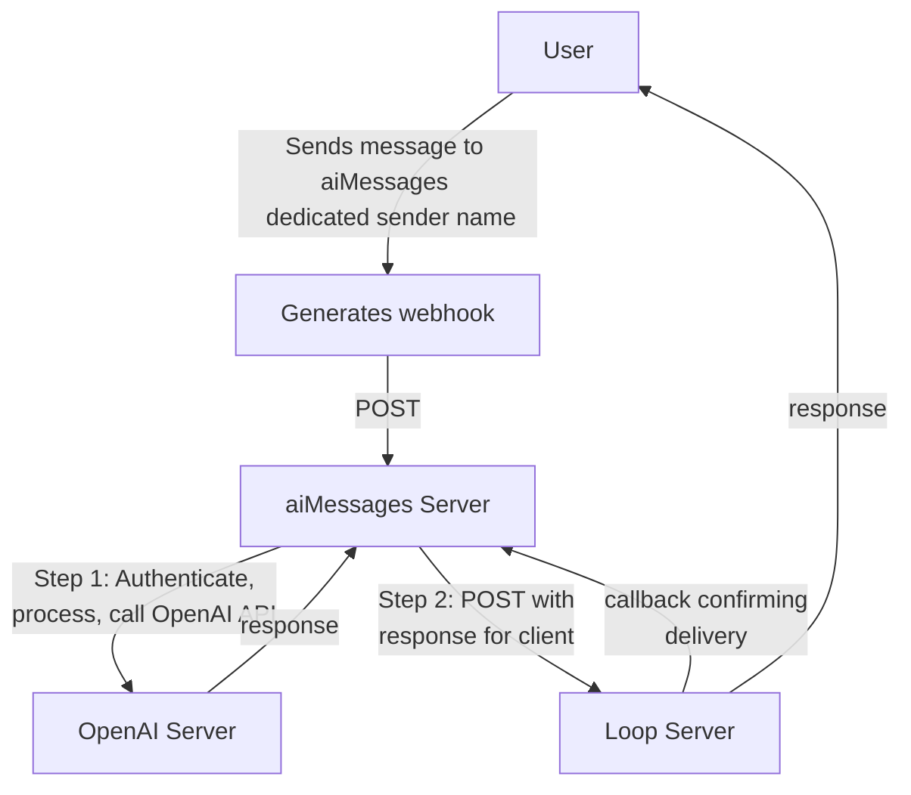

## Overview

[Firebase](firebase.google.com) is Google's web and mobile app development platform, and it was absolutely essential in supporting us to deploy the aiMessages iOS app as quickly as we did. It includes dozens of developer tools and services to build, deploy, grow, and monetize apps. Essentially, it's a Backend-as-a-service (BaaS). It has exceptional documentation, great SDKs, a variety of database options, and tons of useful services: like built-in user authentication, analytics, the Firebase Local Emulator Suite, A/B testing, dynamic links, and performance testing. One of the most developer-friendly reasons for choosing Firebase is that they offer no-cost tier pricing plans for all of their products. For us, that meant we never paid more than a few cents a month until we really started to grow and acquire users, even then, when we peaked at around ~3,000 users, we never paid more than a few dollars per month.  

Basically, Firebase is everything you would expect and hope for from a company like Google, and it was incredibly low friction to get started. Since they support the entire tech stack, both Jake and I were able to utilize the SDKs and documentation to build out the frontend (Jake) and backend (me). In this article, I just plan to touch on the services and products I used most often with the backend development. 

## Cloud Functions

Cloud Functions for Firebase is a serverless framework that lets you automatically run backend code in response to events triggered by background events, HTTPS requests, the Admin SDK, or Cloud Scheduler jobs. If you're like me, the first time you hear about serverless frameworks and serverless functions it sounds fancy and complicated, but it's not! You just write the code you need to handle your backend processes, and when you're ready to deploy to production servers, you run the `firebase deploy --only functions` command from your CLI. So easy! Google then deploys your code to a server that they manage (somewhere in, "the cloud"), and exposes a HTTP endpoint that can then receive requests. This HTTP endpoint looks something like this: `https://<location>-<app_id>.cloudfunctions.net/loopMessageWebhookHandler`, depending on the app id, server location, and function name. 

Here's an example of what a cloud function could look like:

```ts
// index.ts

exports.callableExtensionImageHandler = functions
  .runWith({
    secrets: [
      "LOOP_AUTH_SECRET_KEY",
      "LOOP_SECRET_API_KEY_FOR_CONVERSATION",
      "STABILITY_API_KEY",
      "CLIPDROP_API_KEY",
    ],
  })
  .https
  .onCall(async (data, context) => {
    // Checking that the user is authenticated.
    if (!context.auth || !context.auth.uid) {
      // Throwing an HttpsError so that the client gets the error details.
      throw new functions.https.HttpsError(
        "failed-precondition",
        "The function must be called while authenticated (need a valid uid)."
      );
    }
    // grab the uid and initialize sessionId
    const uid: string = context.auth?.uid || "";
    const sessionId: string = uuidv4();

    // Step 1.)
    // Check user status: valid subscription and/or message credits remaining
    const {
      isValidSubscription,
      hasValidMessagesRemaining,
      wasUserWarnedNoCreditsRemaining,
    } = await checkValidSubscriptionOrMessagesRemaining(dataManager, uid);

// rest of processing...
```

This is actually the first part of an aiMessages function that is called by the client when they request to generate a new image. This HTTP endpoint receives `context` (the user's auth information) so that we can first confirm the incoming request to this function is from a valid, active user. If it's not a valid user, we immediately stop execution and return an error. You can also see that when this function runs, it pulls in `secrets` that are stored and protected by Firebase - more on this below. 

When we built aiMessages, Firebase Cloud Functions was still on 1st gen, so backend code deployed to Cloud Functions for Firebase had to be JavaScript or TypeScript. With the release of 2nd gen towards the end of 2023, you can now deploy Python code as well. 

The **AMAZING** thing about Cloud Functions is that you can deploy and store your JavaScript, TypeScript, or Python code on Google Cloud infrastructure, and it runs in a managed environment. There's no need to manage and scale your own servers, Firebase does it for you. I don't think I fully appreciated the beauty and convenience of serverless frameworks until I was building aiMessages. Now, having used Firebase, I cannot imagine managing my own server. When you manage your own server, you have to worry about security, updates, maintenance, etc. **AND** you also have to manage how you scale as you grow your app and add users. For us with Firebase, we would be able to seamlessly scale from 100 users, to 1000, to 100,000, because Google would handle it all for us. 

## Pub/Sub

One of the software engineering concepts I was able to learn by building this app was pub/sub, or publish/subscribe. Pub/Sub is a messaging pattern that allows applications to exchange messages asynchronously without knowing the identity of the sender or recipient. In this model, publishers create messages that subscribers then consume. For our backend aiMessages codebase, we used pub/sub to provide event-driven application design, specifically when processing and handling incoming iMessages from users. 

As discussed in an [earlier blog post](https://lwcarani.github.io/posts/aimessages-reflections-3/), when users sent an iMessage to our dedicated sender number, Loop would generate a webhook POST request that would get sent to the HTTP endpoint of our cloud function designated to handle iMessages. Here's what that flowchart looks like, as a reminder:



And here's the first part of that serverless function to process the incoming iMessage:

```ts
// index.ts 

// Take the Loop Webhook event passed to this HTTP endpoint and insert it into
// Firestore under the path /messages/:documentId/original
// Loop servers send POST requests, with the body in JSON representation
// We must return a 200 status code
// Loop requires we respond quickly so we do not timeout (15 seconds)
// Loop recommends that apps defer processing until after the response is sent
exports.loopMessageWebhookHandler = functions
  .runWith({
    secrets: [
      "LOOP_AUTH_BEARER_TOKEN",
    ],
  })
  .https
  .onRequest(async (request, response) => {
    // Get secret(s)
    const loopAuthBearerToken = process.env.LOOP_AUTH_BEARER_TOKEN ?? "";

    // Step 1.)
    // if request has proper auth header, immediately send 200 status code,
    // then commence processing
    const authHeader = request.get("authorization");
    const {statusCode, httpsResponseMessage} =
      verifyAuthHeader(authHeader, loopAuthBearerToken);
    console.log("Completed auth step!");

// rest of processing...
```

Once Loop sent the webhook to our server, they expected an `OK` response within 15 seconds, otherwise they would assume the request failed, and try again. My naive (and ignorant) approach to writing this function was to authenticate the incoming webhook (to make sure it was actually a valid webhook that Loop sent), send an `OK` response back, and then continue with generating a response for the user. The problem with this approach is that as soon as you send that initial `OK` response, the cloud function begins to terminate, and Firebase states that all code after the initial response is returned will have undefined behavior. For us, that meant I was (1) authenticating the incoming webhook, (2) sending a response back to Loop telling them the webhook was received, and then (3) calling the OpenAI API to generate a response and then returning that response back to the user. Unfortunately, because of the way I organized the code, reaching step (3) was not guaranteed, and in fact, sometimes users would receive iMessage responses, sometimes they wouldn't. Sometimes it would be super fast, and sometimes it would take 5 minutes (i.e., it was highly undefined, and unpredictable behavior). 

This is where the pub/sub architecture was useful. See our code here: 

```ts
// index.ts

// Take the Loop Webhook event passed to this HTTP endpoint and insert it into
// Firestore under the path /messages/:documentId/original
// Loop servers send POST requests, with the body in JSON representation
// We must return a 200 status code
// Loop requires we respond quickly so we do not timeout (15 seconds)
// Loop recommends that apps defer processing until after the response is sent
exports.loopMessageWebhookHandler = functions
  .runWith({
    secrets: [
      "LOOP_AUTH_BEARER_TOKEN",
    ],
  })
  .https
  .onRequest(async (request, response) => {
    // Get secret(s)
    const loopAuthBearerToken = process.env.LOOP_AUTH_BEARER_TOKEN ?? "";

    // Step 1.)
    // if request has proper auth header, immediately send 200 status code,
    // then commence processing
    const authHeader = request.get("authorization");
    const {statusCode, httpsResponseMessage} =
      verifyAuthHeader(authHeader, loopAuthBearerToken);
    console.log("Completed auth step!");

    // Set session_id and get alert_type of webhook
    const alertType: AlertType = request.body.alert_type ?? AlertType.UNKNOWN;
    let sessionId: string;
    // if sessionId is present in passthrough data of request body,
    // use that, otherwise, assign new sessionId to use for this webhook
    // Generally, passthrough.sessionId is present if this
    // is a "message_sent" webhook
    if ("passthrough" in request.body) {
      const passthroughData: string = request.body.passthrough ?? "";
      let passthroughDataJSON: any;
      if (passthroughData) {
        passthroughDataJSON = JSON.parse(passthroughData);
        sessionId = passthroughDataJSON.sessionId ?? "";
      } else {
        sessionId = "";
      }
    } else {
      sessionId = uuidv4();
    }

    // Log start of webhook processing
    const toLog: LoggingObject = {
      session_id: sessionId,
      event_type: LoggingEventType.INCOMING_WEBHOOK,
      event_provider: LoggingEventProvider.LOOP_MESSAGE,
      event_status: LoggingEventStatus.RECEIVED,
      http_info: alertType,
      http_type: 200,
    };
    console.log(JSON.stringify(toLog));

    // Publish loop webhook body to the Pub/Sub
    const pubsub = new PubSub();
    const topic = pubsub.topic("loop-webhook-process");
    const json = request.body;
    json["session_id"] = sessionId;
    const typing: number = (alertType === AlertType.MESSAGE_INBOUND) ? 5 : 0;

    // publish message, then once promise is resolved that
    // message has been published, return statusCode back to loop
    // if there is an error, send loop a 500 code so that they retry

    // Log start of Pub/Sub
    const toLogPubSub: LoggingObject = {
      session_id: sessionId,
      event_type: LoggingEventType.PUBLICATION,
      event_provider: LoggingEventProvider.LOOP_MESSAGE,
      event_status: LoggingEventStatus.REQUESTED,
      http_type: 200,
    };
    console.log(JSON.stringify(toLogPubSub));

    topic.publishMessage({json})
      .then((messageId) => {
        // Log Pub/Sub finish
        const toLogPubSub: LoggingObject = {
          session_id: sessionId,
          event_type: LoggingEventType.PUBLICATION,
          event_provider: LoggingEventProvider.LOOP_MESSAGE,
          event_status: LoggingEventStatus.COMPLETED,
          http_type: 200,
          http_info: messageId,
        };
        console.log(JSON.stringify(toLogPubSub));
        response.status(statusCode).send(
          {
            message: httpsResponseMessage,
            typing: typing,
            read: true,
          }
        );
      })
      .catch((error: any) => {
        console.log(error);
        // Log Pub/Sub failed (bad gateway)
        const toLogPubSub: LoggingObject = {
          session_id: sessionId,
          event_type: LoggingEventType.PUBLICATION,
          event_provider: LoggingEventProvider.LOOP_MESSAGE,
          event_status: LoggingEventStatus.FAILED,
          http_type: 502,
        };
        console.log(JSON.stringify(toLogPubSub));
        response.status(502).send("Error publishing message.");
      });
  });
```

And specifically we'll focus on this part of the code: 

```ts
// index.ts

// Publish loop webhook body to the Pub/Sub
  const pubsub = new PubSub();
  const topic = pubsub.topic("loop-webhook-process");
  const json = request.body;
  json["session_id"] = sessionId;
  const typing: number = (alertType === AlertType.MESSAGE_INBOUND) ? 5 : 0;
  topic.publishMessage({json})
    .then((messageId) => {
      //...
      response.status(statusCode).send(
        {
          message: httpsResponseMessage,
          typing: typing,
          read: true,
        }
      );
    })
    .catch((error: any) => {
      console.log(error);
      // Log Pub/Sub failed (bad gateway)
      //...
      response.status(502).send("Error publishing message.");
    });
});
```

Not seen in the code, we have a function that handles pub/sub events, with topic name `loop-webhook-process` (`exports.loopMessageWebhookHandlerPubSub`, see below). We publish a message to the subscriber by calling:

`pubsub.topic("loop-webhook-process").publishMessage({json})`.

 In the above code snippet, we're publishing a `json` message to this pub/sub function that contains all of the pertinent information from the user that sent the iMessage. If the `json` message is successfully published to `exports.loopMessageWebhookHandlerPubSub`, then we can return an `OK` status code back to Loop that the message webhook was correctly received (inside the `then` block). The `exports.loopMessageWebhookHandler` function above can now safely terminate, because by publishing a message to the `loop-webhook-process` pub/sub function, we've triggered the rest of the code that will actually call the OpenAI API, generate a response, and send the response back to the user. 

Here is the code for the subscriber function: `exports.loopMessageWebhookHandlerPubSub`. This is the code block that executes after receiving the `json` message: 

```ts
// index.ts

exports.loopMessageWebhookHandlerPubSub = functions
.runWith({
  secrets: [
    "LOOP_AUTH_SECRET_KEY",
    "LOOP_SECRET_API_KEY_FOR_CONVERSATION",
    "OPENAI_API_KEY",
  ],
})
.pubsub
.topic("loop-webhook-process")
.onPublish(async (message) => {
  // Get secret(s)
  const loopAuthSecretKey = process.env.LOOP_AUTH_SECRET_KEY ?? "";
  const loopAuthSecretKeyConvo =
    process.env.LOOP_SECRET_API_KEY_FOR_CONVERSATION ?? "";
  const openaiApiKey = process.env.OPENAI_API_KEY ?? "";
  // Initalize api managers
  const openaiApiManager = new OpenaiApiManager(openaiApiKey);
  const loopApiManager = new LoopApiManager(
    loopAuthSecretKey,
    loopAuthSecretKeyConvo
  );

  // message is just request.body from Loop webhook, parse accordingly
  const requestBodyData: any = message.json;
  const alertType: AlertType =
    requestBodyData.alert_type ?? AlertType.UNKNOWN;
  const messageRecipient: string = requestBodyData.recipient ?? "";
  const sessionId: string = requestBodyData.session_id ?? "";

  switch (alertType) {
  case AlertType.CONVERSATION_INITED: {
    console.log("Entering case statement for AlertType.CONVERSATION_INITED");
    await privateConversationInitedWebhookHandler(
      sessionId,
      messageRecipient,
      alertType,
      loopApiManager
    );
    break;
  }
  case AlertType.GROUP_CREATED: {
    console.log(
      "Entering case statement for AlertType.GROUP_CREATED"
    );
    const groupID: string = requestBodyData.group.group_id ?? "";
    await groupCreatedWebhookHandler(
      sessionId,
      messageRecipient,
      groupID,
      alertType,
      loopApiManager
    );
    break;
  }
  case AlertType.MESSAGE_SENT: {
    console.log("Entering case statement for AlertType.MESSAGE_SENT");
    await messageSentWebhookHandler(requestBodyData);
    break;
  }
  case AlertType.MESSAGE_FAILED: {
    console.log("Entering case statement for AlertType.MESSAGE_FAILED");
    await messageFailedOrTimeoutWebhookHandler(requestBodyData);
    break;
  }
  case AlertType.MESSAGE_TIMEOUT: {
    console.log("Entering case statement for AlertType.MESSAGE_TIMEOUT");
    await messageFailedOrTimeoutWebhookHandler(requestBodyData);
    break;
  }
  case AlertType.MESSAGE_INBOUND: {
    console.log("Entering case statement for AlertType.MESSAGE_INBOUND");
    const uid: string = await getUIDGivenIMessageAccount(
      messageRecipient,
      sessionId
    );
    if (!uid) {
      // If uid is null / empty at this point, incoming messageRecipient
      // is not a valid customer, exit control flow, do not send a response
      console.log("Exiting auth flow (no uid), no message response sent.");
      break;
    }
    const {
      isValidSubscription,
      hasValidMessagesRemaining,
      wasUserWarnedNoCreditsRemaining,
    } = await checkValidSubscriptionOrMessagesRemaining(dataManager, uid);

    if (
      !isValidSubscription &&
      !hasValidMessagesRemaining &&
      !wasUserWarnedNoCreditsRemaining
    ) {
      // If the customer does not have a valid description, and
      // if the customer does not have valid message tokens remaining,
      // exit control flow, do not send a response
      await loopApiManager.sendNotificationMessageToUserOutOfMessageCredits(
        dataManager,
        uid,
        sessionId
      );
      break;
    } else if (!isValidSubscription && !hasValidMessagesRemaining) {
      console.log("Exiting auth flow, no message response sent.");
      break;
    }

    if ("group" in requestBodyData) {
      // If valid account with active messages or subscription, proceed
      // Check if this is a group chat with incoming message
      console.log("Entering groupMessageHandler code block");
      await groupMessageHandler(
        requestBodyData,
        sessionId,
        uid,
        isValidSubscription,
        hasValidMessagesRemaining,
        loopApiManager,
        openaiApiManager
      );
    } else {
      // This is a private chat with incoming message
      console.log("Entering privateMessageHandler code block");
      await privateMessageHandler(
        requestBodyData,
        sessionId,
        uid,
        isValidSubscription,
        hasValidMessagesRemaining,
        loopApiManager,
        openaiApiManager
      );
    }
    break;
  }
  default: {
    console.log(
      "Entering default case statement for Loop Webhook Handler AlertType"
    );
    console.log(`Incoming alert didn't trigger a response: ${alertType}.`);
    console.log("Exiting auth flow, no message response sent.");
  }
  }
  // Log completion of webhook processing
  const toLog: LoggingObject = {
    session_id: sessionId,
    event_type: LoggingEventType.INCOMING_WEBHOOK,
    event_provider: LoggingEventProvider.LOOP_MESSAGE,
    event_status: LoggingEventStatus.COMPLETED,
    http_info: alertType,
    http_type: 200,
  };
  console.log(JSON.stringify(toLog));
  return null;
});
```

Now that we've more appropriately modularized our function logic, we ensure that (1) Loop receives a timely `OK` message back to their server, and (2), we can correctly generate a response to send back to the user in a timely, consistent, and predictable manner. 

## NoSQL

Integrated with Firebase, [Cloud Firestore](https://firebase.google.com/products/firestore#:~:text=Cloud%20Firestore%20is%20a%20NoSQL,web%20apps%20%2D%20at%20global%20scale.) is a NoSQL document database that lets you easily store, sync, and query data for your mobile and web apps, at a *global* scale. It has robust client libraries, full support for offline mode, comprehensive security rules to manage access, an easy data browsing tool, and powerful query and fetching (in near real-time). Perhaps most importantly, it is integrated with cloud functions, so you can run server-side logic in response to changes in your database (which is a feature we used heavily). 

Here's a simple example:

```ts
// index.ts

exports.imageHistoryDeleteFromStorage = functions
  .firestore
  .document("/extensionImageHistory/{uid}/imageResponses/{documentID}")
  .onDelete(async (snap, context) => {
    // grab the uid and documentID from context.params
    const uid: string = context.params.uid;
    const documentID: string = context.params.documentID;

    return admin.storage().bucket().deleteFiles({
      prefix: `historyImages/${uid}/${documentID}/`,
    })
      .catch((error: any) => {
        console.log(error.message);
        console.log(`Failed to delete all images of user ${uid}`);
      });
  });
```

This is an actual function we had deployed to our serverless environment. For every user, every image they generated was cached on their local device, and also stored in Google Cloud Storage, so that we could sync the images for them across their devices. Every image that we stored in Cloud Storage had a unique download URL to access that image. To track these images, we stored the URL associated with a particular image for a particular user in our Cloud Firestore NoSQL database. So, in the function above, `"/extensionImageHistory/{uid}/imageResponses/{documentID}"` is the file path to the document that contains an image URL for the user with the given `uid`. This function has a listener set up to the `extensionImageHistory` collection and `imageResponses` sub-collection, so when any documentIDs are deleted (i.e., `onDelete`), we can run server-side logic in response to the database change. In this example, when a user chooses to delete an image, the client deletes the documentID from the Cloud Firestore NoSQL database. The above function will then automatically run, triggering the deletion of the actual image from our Google Cloud Storage bucket that contained the `.jpeg` or `.png` file.

> The Cloud Firestore NoSQL document database can only store text information, hence the need to store `.png` or `.jpeg` files in Cloud Storage buckets.
{: .prompt-info }

## Idempotent Coding

Idempotence is the property of certain operations in mathematics and computer science where it (the operation) can be applied multiple times without changing the result beyond the initial application. Basically, we want to write our functions in such a way that they produce the same result if they run multiple times for a single event. This is especially important for things like tracking user message credits - if the same function gets pinged multiple times saying that the user used a message credit by generating an image on aiMessages, we want to make sure we only charge the user for the number of unique images they generated. Here's how we handled that for aiMessages.

When a user creates an image, sends a private message, or sends a group message, we create a receipt once we confirm the transaction is complete. This receipt generates a unique documentID that is associated with that transaction, and is stored in our Cloud Firestore NoSQL document database. We store this documentID on their receipt for that transaction, so that we have a record of the user's `latestReceipt`. Now, when a new documentID is created for that user, we can compare the new documentID to the last documentID stored on the `latestReceipt` for the user, and see if they are different. If they are different, we know this is a new transaction, and we can charge the user a message credit for the transaction. If the documentIDs are the same, we know we already processed this transaction, so we won't charge them again. 

Below is our serverless function that handles this logic. We have a listener set up for the `events` collection, and anytime a new document is created (i.e., `onCreate`), we can pull in the `documentID`, and compare it to the value on `latestReceipt`. 

```ts
// index.ts

exports.chargeUserForExtensionImageUse = functions
.firestore
.document("/customerExpenses/{uid}/extensionMessageImages/{documentID}")
.onCreate(async (snap, context) => {
  // Grab the current value of what was written to Firestore
  const data: admin.firestore.DocumentData = snap.data();
  const amount = Number(data.amount ?? 1);
  const chargeType: ChargeType | undefined =
    data.paidWithSubscriptionOrToken ?? undefined;
  const uid: string = context.params.uid ?? "";
  const docID: string = context.params.documentID ?? "";
  let {
    numberOfMessagesRemaining,
    latestReceipt,
  } = await getNumMessagesRemainingAndLatestReceipt(dataManager, uid);

  // check latest receipt to ensure idempotency
  if (docID === latestReceipt) {
    console.log(
      "Duplicate receipts found, already updated balance. Exiting."
    );
    return null;
  }

  if (chargeType === ChargeType.TOKEN) {
    numberOfMessagesRemaining = numberOfMessagesRemaining - amount;
  }

  const dataToUpload: DocumentData = {
    numberOfMessagesRemaining: numberOfMessagesRemaining,
    wasUserWarnedNoCreditsRemaining: false,
    latestReceipt: docID,
  };
  try {
    return dataManager.setDocument(
      dataToUpload,
      Collection.CONSUMABLE_BALANCE,
      uid
    );
  } catch (error: any) {
    console.log(
      "Error during consumableBalance data upload: ",
      error.message
    );
    return null;
  }
});
```

Specifically, we conduct a check in the middle of the above function to make sure we haven't already processed this receipt: 

```ts
// check latest receipt to ensure idempotency
if (docID === latestReceipt) {
  console.log(
    "Duplicate receipts found, already updated balance. Exiting."
  );
  return null;
}
```

Thus, we ensure idempotency, and prevent over-charing our users. 

## Secret Handling

To help you store sensitive configuration information, Cloud Functions for Firebase integrates with Google Cloud Secret Manager. This encrypted service stores configuration values securely, while still allowing easy access from your functions when needed. Secret Manager is a paid service, but it comes with a free tier! This was my preferred way to manage API keys for this project. You simply use the Firebase CLI to enter a "secret", and then when a cloud function runs, you can access the secret using `process.env.<SECRET>` just like you would for any other `.env` global variable! It is safe, secure, and just as important, super easy to use. See below for an example:

```ts
// index.ts

exports.loopMessageWebhookHandlerPubSub = functions
.runWith({
  secrets: [
    "LOOP_AUTH_SECRET_KEY",
    "LOOP_SECRET_API_KEY_FOR_CONVERSATION",
    "OPENAI_API_KEY",
  ],
})
.pubsub
.topic("loop-webhook-process")
.onPublish(async (message) => {
  // Get secret(s)
  const loopAuthSecretKey = process.env.LOOP_AUTH_SECRET_KEY ?? "";
  const loopAuthSecretKeyConvo =
    process.env.LOOP_SECRET_API_KEY_FOR_CONVERSATION ?? "";
  const openaiApiKey = process.env.OPENAI_API_KEY ?? "";

// rest of processing...
```

## Takeaways

Firestore is an amazingly useful platform, that makes it very easy for startups and new apps to get off the ground. It is very cost-effective, especially when you're just starting out, and has a lot of great tooling available so you don't have to spend time implementing your own auth flow, building, maintaining, and scaling your own servers, configuring your own environment and secrets, or running analytics; you can just focus on your app. 

If I ever build another app in the future, I'll definitely be using Firebase!